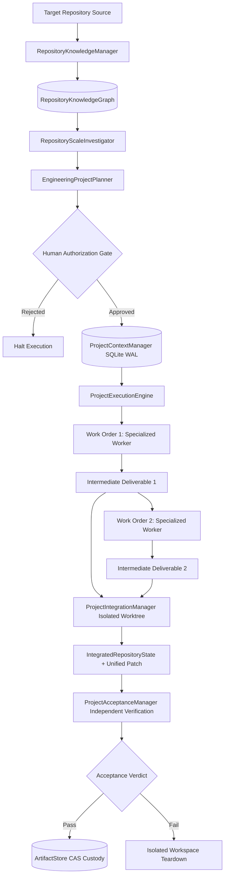

# Autonomous Engineering System: Phase 10 Operational Runbook
## Repository-Scale Engineering Intelligence and Project Execution

### 1. System Architecture

Phase 10 extends the Autonomous Engineering System to multi-stage engineering projects that span multiple modules, execution sessions, and work orders.



### 2. Module Directory Structure

```
phase10/
├── docs/
│   ├── phase10_baseline_verification.md
│   ├── phase10_engineering_plan.md
│   └── operational_runbook.md
├── evidence/
│   ├── repository_knowledge_report.md
│   ├── repository_investigation_report.md
│   ├── project_planning_report.md
│   ├── cross_session_context_report.md
│   ├── project_execution_report.md
│   ├── project_integration_report.md
│   ├── project_acceptance_report.md
│   ├── recovery_qualification_report.md
│   ├── engineering_project_cohort_results.md
│   ├── adversarial_security_report.md
│   ├── protected_service_audit.md
│   ├── demo_execution.log
│   ├── final_report.md
│   ├── phase10_executive_summary.md
│   └── manifest.sha256
├── src/
│   └── autonomous_engineering/
│       ├── investigation/
│       │   └── project_investigator.py
│       ├── knowledge/
│       │   └── manager.py
│       └── project/
│           ├── acceptance.py
│           ├── context.py
│           ├── engine.py
│           ├── integration.py
│           └── planner.py
├── tests/
│   ├── test_phase10_adversarial_security.py
│   ├── test_phase10_preregistration_gates.py
│   ├── test_project_acceptance.py
│   ├── test_project_context.py
│   ├── test_project_execution_engine.py
│   ├── test_project_integration.py
│   ├── test_project_planning.py
│   ├── test_repository_investigation.py
│   └── test_repository_knowledge.py
└── run_demo.py
```

### 3. Operational Lifecycles & Operator Instructions

#### 3.1 Indexing Repository Knowledge
```python
from autonomous_engineering.knowledge.manager import RepositoryKnowledgeManager

km = RepositoryKnowledgeManager()
graph = km.index_repository(repo_dir=Path("/path/to/repo"), repository_id="my-repo", baseline_commit="HEAD")
print(f"Indexed {len(graph.symbols_by_file)} files, digest: {graph.compute_digest()}")
```

#### 3.2 Running Multi-Module Investigation & Impact Analysis
```python
from autonomous_engineering.investigation.project_investigator import RepositoryScaleInvestigator

investigator = RepositoryScaleInvestigator(graph)
impact = investigator.analyze_change_impact(target_files=["src/core.py"])
print(f"Risk: {impact.risk_level}, Downstream modules: {impact.downstream_dependent_modules}")
```

#### 3.3 Decomposing Objectives into Human-Authorized Plans
```python
from autonomous_engineering.project.planner import EngineeringProjectPlanner, ProjectWorkOrder

planner = EngineeringProjectPlanner(repository_id="my-repo", baseline_commit="commit-sha")
wo1 = ProjectWorkOrder("wo-1", "Refactor core", "defect_repair", ["src/core.py"], ["src/core.py"], "implementation-engineer", [], [], 2048)
unauth_plan = planner.create_project_plan("proj-001", 1, "Upgrade core", ["src/"], [wo1], [])

# Human Authorization Gate (automated self-authorization is prohibited)
plan = planner.authorize_plan(unauth_plan, authorizer_identity="lead@corp.internal", authorizer_role="principal_engineer")
```

#### 3.4 Executing Multi-Stage Projects
```python
from autonomous_engineering.project.context import ProjectContextManager
from autonomous_engineering.project.engine import ProjectExecutionEngine
from autonomous_engineering.artifacts.store import ArtifactStore

ctx_mgr = ProjectContextManager(Path("project_context.db"))
store = ArtifactStore(Path("artifacts_store"))
engine = ProjectExecutionEngine(context_manager=ctx_mgr, artifact_store=store)

result = engine.execute_project(plan=plan, base_repo_dir=Path("/path/to/repo"))
print(f"Result: {result.status}, Digest: {result.integrated_state.unified_patch_digest}")
```

### 4. Emergency Procedures & Deterministic Rollback

If an integrated project needs to be reversed after human inspection:
1. Locate the `IntegratedRepositoryState` record or delivery bundle.
2. Verify baseline commit matches repository state:
   ```bash
   git rev-parse HEAD
   ```
3. Apply the deterministic reverse patch:
   ```bash
   patch -p1 -R < project_deliverable.patch
   ```
4. Verify workspace cleanliness:
   ```bash
   git status --short
   ```

### 5. Verification Commands

To execute the complete cumulative regression suite across all 11 phases (Phases 0–10):
```bash
PYTHONPATH=phase10/src:phase9/src:phase8/src:phase7/src:phase6/src:phase5/src:phase4/src:phase3/src:phase2/src:phase1/src:phase0/src pytest phase0/tests phase1/tests phase2/tests phase3/tests phase4/tests phase5/tests phase6/tests phase7/tests phase8/tests phase9/tests phase10/tests -q
```
Expected output:
```
306 passed in ~150s (100% PASS)
```
