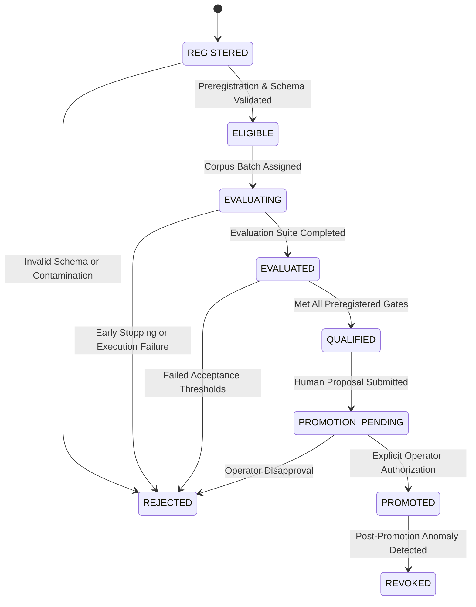

# Autonomous Engineering System: Phase 11 Engineering Plan
## Evidence-Driven Model and Agent Optimization

**Version**: 1.0.0-PROVISIONAL  
**Status**: ACTIVE / FROZEN  
**Target Git Branch**: `phase11-model-agent-optimization`  
**Base Commit**: `5c1ea326398162360c4f76133db87113eb1eae22`  
**Target Disposition**: `PHASE_11_EVIDENCE_DRIVEN_OPTIMIZATION: PROVEN`

---

## 1. Current Architecture and Qualification Boundaries

Phase 11 builds directly upon the Phase 7–10 foundation without introducing disjoint frameworks or bypassing existing authority gates:
- **Phase 7 (Sustained Qualification)**: Persistent work-order fences, dynamic authority revocation, crash consistency.
- **Phase 8 (Operational Delivery)**: Multi-repo governance, human-authorized pull requests, content-addressed deliverables.
- **Phase 9 (Adaptive Specialized Orchestration)**: Immutable versioned agent profiles, 5-tuple qualification keys, multidimensional workload classification, 2-stage scheduling, bounded reasoning escalations, typed handoffs.
- **Phase 10 (Repository-Scale Intelligence & Project Execution)**: Versioned repository knowledge graphs, deep architectural investigation, acyclic project planning, durable cross-session context (SQLite WAL), isolated cross-task integration, independent project-level acceptance.

### Architectural Boundary
Phase 11 implements the optimization layer that systematically measures, qualifies, and selects optimal combinations across the 8-dimensional configuration space:
$$\text{Candidate Space} = \text{Model} \times \text{Quantization} \times \text{Profile} \times \text{Reasoning} \times \text{Context} \times \text{Adapter} \times \text{Hardware Worker} \times \text{Workload Class}$$

The primary objective is to **maximize independently accepted engineering work per unit of time and resource consumption**, while strictly preserving authority, integrity, reliability, and protected-service non-interference guarantees.

---

## 2. Protected-Control Configuration and Rollback Identity

The protected baseline serving configuration on the Dell Precision T5820 node (`10.0.8.5`) is the immutable control:
- **Model Identity**: `engineering/b0` (`Qwen/Qwen3-Coder-30B-A3B-Instruct-AWQ-4bit`).
- **Physical Topology**: 2x physical Intel Arc Pro B65 GPUs (16GB VRAM each) serving independent TP=1 vLLM workers behind gateway port `18010` via SSH tunnel.
- **Rollback Identity**: `control-b0-qwen3-coder-awq-tp1-v1`.
- **Inference Invariant**: Resident models on physical GPUs shall **never** be swapped, stopped, or reloaded without explicit operator maintenance authorization.
- **Rollback Procedure**: In the event of any experimental anomaly or regression, routing immediately defaults to the protected control configuration without human intervention.

---

## 3. Candidate Configuration Schema

Every evaluated configuration must be registered with complete, immutable specifications in the `OptimizationCandidateRegistry`:

```python
@dataclass(frozen=True)
class CandidateConfiguration:
    candidate_id: str
    model_identifier: str
    model_revision: str
    quantization: str  # e.g., "AWQ-4bit", "FP8", "BF16"
    inference_backend: str  # e.g., "vLLM-XPU-0.6.2"
    runtime_parameters: Dict[str, Any]  # temperature, top_p, max_tokens, etc.
    agent_profile_id: str  # e.g., "implementation-engineer"
    agent_profile_version: str  # e.g., "1.1.0"
    agent_profile_digest: str  # SHA-256 of immutable profile
    context_strategy_version: str  # e.g., "symbol-dependency-v2"
    reasoning_allocation_policy: str  # e.g., "complexity-bounded-escalation"
    tool_adapter_version: str  # e.g., "sandboxed-posix-v2"
    physical_resource_requirements: Dict[str, Any]  # vram_mb, compute_units
    evaluation_corpus_version: str
    execution_mode: ExecutionMode  # PHYSICAL, SIMULATED, HISTORICAL_REPLAY
```

### Canonical Configuration Digest
$$\text{ConfigDigest} = \text{SHA256}(\text{JSON}(\text{sorted\_fields}(\text{CandidateConfiguration})))$$
No two candidates may share a digest unless their configurations are identical in every dimension.

---

## 4. Workload Corpus Design

The `EngineeringEvaluationCorpusManager` establishes a versioned corpus of representative software engineering tasks:
1. **Workload Classes**:
   - `repository_investigation`: Multi-module tracing and symbol discovery.
   - `defect_repair`: Localized bug fixing against failing regression tests.
   - `multi_file`: Cross-module refactoring and feature implementation.
   - `architectural_planning`: Multi-stage DAG project planning and decomposition.
   - `test_development`: Unit and integration test suite generation.
   - `security_analysis`: Static security analysis and vulnerability remediation.
   - `performance_investigation`: Hotspot identification and algorithmic optimization.
   - `cross_task_integration`: Merging independent intermediate deliverables.
   - `multi_stage_project`: End-to-end multi-work-order project execution.
   - `recovery`: Resumption from mid-execution crash checkpoints.
   - `adversarial_scope`: Attempts to escape authorized mutation boundaries.
   - `tool_call_reliability`: Structured JSON and tool-call schema adherence.

2. **Partitioning**:
   - **Development Partition (30%)**: Used for prompt tuning, profile iteration, and exploratory experiments.
   - **Calibration Partition (30%)**: Used for hyperparameter search and threshold tuning.
   - **Held-Out Evaluation Partition (40%)**: Strictly quarantined; never exposed to candidate optimization. Evaluates final candidate qualification.

---

## 5. Evaluation Isolation and Contamination Controls

1. **Quarantine of Held-Out Data**:
   - Held-out corpus tasks are stored with read-only permissions and verified with cryptographic SHA-256 manifests.
   - Optimization routines attempting to read held-out fixtures during training/tuning raise `CorpusContaminationError`.
2. **Clean Execution Workspaces**:
   - Each task executes in an isolated temporary worktree populated fresh from the baseline repository commit.
   - Zero shared state between task runs; temporary worktrees are torn down upon acceptance validation.
3. **Cross-Candidate Isolation**:
   - Candidates execute under dedicated session namespaces. Context, checkpoints, and handoff packages are cryptographically bound to `(candidate_id, task_id)`.

---

## 6. Independent Validation Methodology

The `EngineeringCandidateEvaluator` evaluates complete engineering outcomes using the existing Phase 7–10 independent acceptance infrastructure:
1. **End-to-End Metrics**:
   - Independent Acceptance Rate ($\%$ of tasks receiving `ValidationStatus.ACCEPTED`).
   - First-Pass Acceptance Rate ($\%$ accepted without repair iterations).
   - Correct Rejection Rate ($\%$ of adversarial/invalid tasks rejected).
   - Repair Iteration Count (bounded to $\le 2$).
2. **Computational & Resource Metrics**:
   - End-to-end task wall-clock duration ($s$).
   - Time-to-First-Token (TTFT, $ms$).
   - Decoding throughput ($tokens/s$).
   - Input and output token consumption.
   - Peak VRAM allocation ($MB$) and sustained host memory ($MB$).
3. **Failure Mode Categorization**:
   Every failure is explicitly attributed to:
   $$\text{FailureMode} \in \{\text{MODEL\_DEFECT}, \text{ORCHESTRATION\_ERROR}, \text{INFRASTRUCTURE\_FAULT}, \text{TOOL\_ADAPTER\_FAILURE}, \text{VALIDATOR\_REJECTION}\}$$
   Results are broken down by workload class and agent profile rather than aggregated into an opaque score.

---

## 7. Statistical Comparison Methodology

The `ComparativeQualificationManager` compares candidates against the protected control using paired evaluation:
1. **Paired Workload Evaluation**: Candidate and control execute identical tasks under identical initial repository states and authority contracts.
2. **Minimum Sample Size**: $N \ge 12$ tasks across $\ge 4$ workload classes for valid comparative statistical qualification.
3. **Stopping Rules**:
   - Early termination if candidate exhibits $\ge 2$ consecutive critical security/scope breaches.
   - Early termination if candidate acceptance rate falls below $50\%$ on calibration tasks.
4. **Promotion Thresholds**:
   - **Acceptance Criterion**: Candidate acceptance rate $\ge$ Control acceptance rate.
   - **Security Criterion**: Zero unauthorized mutations, zero scope expansions, zero static security violations.
   - **Efficiency Criterion**: Statistically significant reduction in token consumption or wall-clock duration ($\ge 10\%$ improvement at $p < 0.05$) without acceptance degradation.

---

## 8. Resource and Hardware Measurement Plan

1. **Physical Arc Pro B65 Hardware Constraints**:
   - Memory capacity: 16,384 MB VRAM per card.
   - Resident model footprint (`engineering/b0`): ~12,800 MB VRAM.
   - Headroom for KV cache and scratch activations: ~3,500 MB VRAM.
2. **Telemetry Collection**:
   - Sample GPU VRAM and engine status via Intel XPU monitoring hooks during execution.
   - Track host RAM and CPU utilization before, during, and after task execution.
3. **Hardware Non-Interference Policy**:
   - Candidate evaluations requiring replacement of `engineering/b0` on physical GPUs remain blocked pending explicit authorization.
   - Physical comparative campaigns evaluate profile, prompt, reasoning, context, and adapter dimensions directly against the resident control model on `127.0.0.1:18010`.

---

## 9. Model and Agent Qualification Lifecycle

The `CandidateQualificationLifecycle` enforces a state machine with fail-closed transitions:



Every state transition requires cryptographic binding to candidate digest, corpus version, and evaluation evidence hashes.

---

## 10. Promotion and Rollback Policy

1. **Promotion Requirements**:
   - Explicit human operator authorization with recorded operator identity.
   - Candidate has status `QUALIFIED`.
   - Verified automated rollback plan and clean rollback test.
2. **Rollback Trigger Conditions**:
   - Any runtime regression in accepted task rate on live work orders.
   - Any unhandled exception in tool calling or structured output.
   - Any host process disruption.
3. **Rollback Execution**:
   - Reverts routing tables and scheduler candidate preferences to `control-b0-qwen3-coder-awq-tp1-v1` in $< 1.0$ second.

---

## 11. Experiment Scheduling and Concurrency Controls

The `OptimizationExperimentScheduler` manages experiment dispatch:
1. **Concurrency Cap**: Max 2 concurrent tasks to avoid saturating physical inference workers.
2. **Priority Queuing**: Production work orders take absolute precedence over optimization experiment batches.
3. **Checkpoint & Pause**:
   - Experiments can be paused, resumed, or cancelled cleanly without leaking orphaned processes.
   - Checkpoints recorded in SQLite storage every $N$ completed tasks.

---

## 12. Evidence Custody and Reproducibility

1. **Raw Trace Persistence**: Complete prompt inputs, model outputs, tool calls, and validation logs stored in `phase11/evidence/`.
2. **Content-Addressed Hashing**: All evidence files signed into `phase11/evidence/manifest.sha256`.
3. **Deterministic Seed & Replay**: All randomized parameters bound to deterministic seeds for reproducible replay.

---

## 13. Preregistered Acceptance Gates (G1–G15)

The quantitative thresholds and evaluation criteria are frozen:

| Gate | Requirement | Target Threshold | Primary Verification Artifact |
|---|---|---|---|
| **G1** | Baseline & protected control integrity | 306/306 passing tests; PIDs 986, 3130937, 2093382 undisturbed; `engineering/b0` live | `phase11_baseline_verification.md` |
| **G2** | Versioned evaluation corpus | 12 workload classes; 3 distinct partitions (dev/calib/held-out); zero contamination | `evaluation_corpus_report.md` |
| **G3** | Candidate configuration registry | Immutable schemas; canonical 64-char digests; execution mode tracking | `candidate_registry_report.md` |
| **G4** | Independent candidate evaluation | E2E acceptance, tokens, time, resource metrics, failure categorization | `independent_evaluation_report.md` |
| **G5** | Comparative qualification | Paired comparison against protected control; preregistered thresholds enforced | `comparative_qualification_report.md` |
| **G6** | Model & quantization hardware qualification | Dual-B65 VRAM constraints verified; physical swap maintenance gating | `model_quantization_report.md` |
| **G7** | Specialized agent profile optimization | 3-way permission intersection preserved; held-out evaluation verified | `agent_profile_optimization_report.md` |
| **G8** | Context & reasoning efficiency | Evidence preservation verified; token reduction quantified; bounded escalation | `context_reasoning_optimization_report.md` |
| **G9** | Experiment scheduling & containment | Concurrency caps enforced; zero interference with protected daemons | `experiment_scheduling_report.md` |
| **G10**| Qualification & promotion lifecycle | Strict 7-state lifecycle; promotion requires explicit human authorization | `qualification_promotion_report.md` |
| **G11**| Adversarial security verification | 16 mandatory attack vectors tested; 100% fail-closed interception | `adversarial_security_report.md` |
| **G12**| Cumulative regression suite integrity | 100% pass rate across Phases 0–11 cumulative regression suite | Test execution log |
| **G13**| Protected host service non-interference | PIDs 986, 3130937, 2093382 continuously active; zero interrupts | `protected_service_audit.md` |
| **G14**| Real-inference comparative campaign | Live evaluation executed against physical `engineering/b0` endpoint | Live campaign trace & report |
| **G15**| Cryptographic deliverable custody & manifest | SHA-256 manifest verified with `sha256sum -c`; verified rollback guide | `final_report.md`, `manifest.sha256` |
