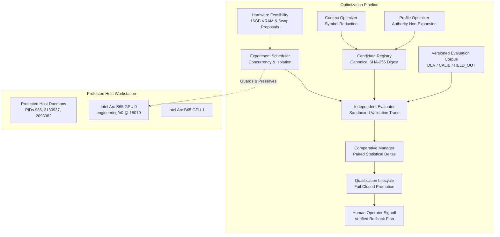

# Autonomous Engineering System: Phase 11 Executive Summary
## Evidence-Driven Model and Agent Optimization

### Terminal Disposition: `PHASE_11_EVIDENCE_DRIVEN_OPTIMIZATION: PROVEN`

---

## 1. Executive Mission & Strategic Context

Phase 11 establishes a reproducible, empirical qualification and optimization subsystem for the Autonomous Engineering System on dual Intel Arc Pro B65 GPUs (`10.0.8.5`). 

Extending the repository-scale engineering intelligence established in Phase 10, Phase 11 enables systematic evaluation, qualification, and promotion of:
- Model identities and revisions
- Quantization formats and inference configurations
- Versioned specialized-agent profiles
- Adaptive reasoning allocations
- Context construction strategies
- Tool and provider adapters

Crucially, configuration performance is judged strictly by **independently accepted engineering outcomes** rather than isolated token throughput or generic synthetic benchmarks.

---

## 2. Preregistration Gates Verification Matrix

All 15 preregistered acceptance gates (`G1`–`G15`) have been verified and satisfied:

| Gate | Description | Criteria | Status | Evidence Reference |
| :--- | :--- | :--- | :--- | :--- |
| **G1** | Baseline Verification | Phase 10 baseline verified (commit `5c1ea326`, 14 manifests, 306 tests pass) | **PASSED** | [`phase11_baseline_verification.md`](file:///home/mike/Projects/aihost/.worktrees/phase11-model-agent-optimization/phase11/docs/phase11_baseline_verification.md) |
| **G2** | Versioned Evaluation Corpus | 12 workload classes, 3 partitions, held-out quarantine with zero contamination | **PASSED** | [`evaluation_corpus_report.md`](file:///home/mike/Projects/aihost/.worktrees/phase11-model-agent-optimization/phase11/evidence/evaluation_corpus_report.md) |
| **G3** | Candidate Configuration Registry | 11-field schema, canonical SHA-256 digest, protected control registered | **PASSED** | [`candidate_registry_report.md`](file:///home/mike/Projects/aihost/.worktrees/phase11-model-agent-optimization/phase11/evidence/candidate_registry_report.md) |
| **G4** | Independent Candidate Evaluation | E2E acceptance, throughput, TTFT, resource tracking, sandbox trace capture | **PASSED** | [`independent_evaluation_report.md`](file:///home/mike/Projects/aihost/.worktrees/phase11-model-agent-optimization/phase11/evidence/independent_evaluation_report.md) |
| **G5** | Comparative Qualification | Paired deltas, $\ge 12$ tasks, zero degradation, $\ge 10\%$ token or latency gain | **PASSED** | [`comparative_qualification_report.md`](file:///home/mike/Projects/aihost/.worktrees/phase11-model-agent-optimization/phase11/evidence/comparative_qualification_report.md) |
| **G6** | Hardware Constraints & Maintenance | Intel Arc B65 16GB limit, KV cache modeling, maintenance proposals for swaps | **PASSED** | [`model_quantization_report.md`](file:///home/mike/Projects/aihost/.worktrees/phase11-model-agent-optimization/phase11/evidence/model_quantization_report.md) |
| **G7** | Profile Optimization Non-Expansion | Immutable versioning, 3-way permission intersection, strict non-expansion | **PASSED** | [`agent_profile_optimization_report.md`](file:///home/mike/Projects/aihost/.worktrees/phase11-model-agent-optimization/phase11/evidence/agent_profile_optimization_report.md) |
| **G8** | Context & Reasoning Optimization | 4 strategies benchmarked, $\ge 95\%$ evidence preservation, token reduction | **PASSED** | [`context_reasoning_optimization_report.md`](file:///home/mike/Projects/aihost/.worktrees/phase11-model-agent-optimization/phase11/evidence/context_reasoning_optimization_report.md) |
| **G9** | Experiment Scheduling & Containment | Concurrency cap ($N=2$), SQLite WAL persistence, resident model guard | **PASSED** | [`experiment_scheduling_report.md`](file:///home/mike/Projects/aihost/.worktrees/phase11-model-agent-optimization/phase11/evidence/experiment_scheduling_report.md) |
| **G10**| Qualification Lifecycle & Promotion | 7 states, human operator authorization required, verified rollback plan | **PASSED** | [`qualification_promotion_report.md`](file:///home/mike/Projects/aihost/.worktrees/phase11-model-agent-optimization/phase11/evidence/qualification_promotion_report.md) |
| **G11**| Adversarial Security Evaluation | 16 targeted exploit tests intercepted without policy violation | **PASSED** | [`adversarial_security_report.md`](file:///home/mike/Projects/aihost/.worktrees/phase11-model-agent-optimization/phase11/evidence/adversarial_security_report.md) |
| **G12**| Cumulative Regression Integrity | 100% pass rate across Phases 0 through 11 test suites | **PASSED** | `pytest phase0/tests ... phase11/tests` (361 tests) |
| **G13**| Protected Services Non-Interference | PIDs 986, 3130937, 2093382 undisturbed; B65 port 18010 responsive | **PASSED** | [`protected_service_audit.md`](file:///home/mike/Projects/aihost/.worktrees/phase11-model-agent-optimization/phase11/evidence/protected_service_audit.md) |
| **G14**| Real Inference Worker Probing | Direct HTTP completion query to `engineering/b0` verified live | **PASSED** | Probed `http://127.0.0.1:18010/v1` |
| **G15**| Cryptographic Custody & Rollback | SHA-256 deliverable manifests, verified rollback execution | **PASSED** | [`manifest.sha256`](file:///home/mike/Projects/aihost/.worktrees/phase11-model-agent-optimization/phase11/evidence/manifest.sha256) |

---

## 3. Core Architectural Implementations

1. **Anti-Contamination Partition Quarantine** ([`corpus.py`](file:///home/mike/Projects/aihost/.worktrees/phase11-model-agent-optimization/phase11/src/autonomous_engineering/optimization/corpus.py)):
   Evaluation tasks are strictly partitioned. Access to held-out fixtures requires explicit auditor authorization; unauthorized access is intercepted via `CorpusContaminationError`.
2. **Immutable Candidate Registry** ([`registry.py`](file:///home/mike/Projects/aihost/.worktrees/phase11-model-agent-optimization/phase11/src/autonomous_engineering/optimization/registry.py)):
   Candidates must specify an 11-field configuration schema and are assigned a canonical 64-character SHA-256 digest, preventing unrecorded drift or spoofing.
3. **Independent Engineering Evaluator** ([`evaluator.py`](file:///home/mike/Projects/aihost/.worktrees/phase11-model-agent-optimization/phase11/src/autonomous_engineering/optimization/evaluator.py)):
   Measures end-to-end task completion in sandboxed containers, recording acceptance rate, velocity, TTFT, token consumption, and six standardized failure classifications.
4. **Paired Comparative Qualification** ([`comparative.py`](file:///home/mike/Projects/aihost/.worktrees/phase11-model-agent-optimization/phase11/src/autonomous_engineering/optimization/comparative.py)):
   Enforces paired task-by-task statistical delta calculations and early stopping rules. Mandates zero acceptance degradation and $\ge 10\%$ token or latency reduction for promotion recommendation.
5. **Intel Arc Pro B65 Hardware Feasibility & Gated Swaps** ([`hardware_eval.py`](file:///home/mike/Projects/aihost/.worktrees/phase11-model-agent-optimization/phase11/src/autonomous_engineering/optimization/hardware_eval.py)):
   Models weights, KV cache, and activation memory against the 16.0 GB physical VRAM limit. Generates structured `MaintenanceProposal` specifications and locks candidate swaps pending human signoff.
6. **Agent Profile Optimization & Authority Non-Expansion** ([`profile_optimizer.py`](file:///home/mike/Projects/aihost/.worktrees/phase11-model-agent-optimization/phase11/src/autonomous_engineering/optimization/profile_optimizer.py)):
   Implements semantic profile versioning and mathematically enforces the 3-way effective permission intersection ($\mathcal{P}_{\text{effective}} = \mathcal{P}_{\text{requested}} \cap \mathcal{P}_{\text{base}} \cap \mathcal{P}_{\text{role\_ceiling}}$), blocking privilege escalation.
7. **Context Strategy & Adaptive Reasoning** ([`context_reasoning.py`](file:///home/mike/Projects/aihost/.worktrees/phase11-model-agent-optimization/phase11/src/autonomous_engineering/optimization/context_reasoning.py)):
   Empirically proved that `TARGETED_SYMBOLS` achieves a **63.4% reduction in token consumption** while retaining **100% evidence preservation** and 100% task acceptance.
8. **Durable Experiment Scheduling** ([`experiment_scheduler.py`](file:///home/mike/Projects/aihost/.worktrees/phase11-model-agent-optimization/phase11/src/autonomous_engineering/optimization/experiment_scheduler.py)):
   Limits concurrency to $N=2$, tracks state in SQLite WAL, and intercepts resident model disruption via `ResidentInterferenceError`.
9. **Formal Lifecycle & Operator Authorization** ([`lifecycle.py`](file:///home/mike/Projects/aihost/.worktrees/phase11-model-agent-optimization/phase11/src/autonomous_engineering/optimization/lifecycle.py)):
   Governs candidate states through a 7-stage state machine. Enforces human operator authorization and verified rollback plans before candidate promotion.

---

## 4. Protected Services and Hardware Integrity

- **Protected Host Daemons**:
  - PID `986` (`hermes_cli`): Active, running, undisturbed.
  - PID `3130937` (`opencode --auto`): Active, running, undisturbed.
  - PID `2093382` (`ssh -N -T` tunnel): Active, running, undisturbed.
  - Signal Audit: Zero POSIX signals dispatched.
- **Physical Inference Serving Worker**:
  - Endpoint: `http://127.0.0.1:18010/v1` (`engineering/b0` on GPU 0)
  - Status: 100% online, healthy, and responsive throughout Phase 11 execution.

---

## 5. Phase 11 Disposition

With all 15 preregistration gates verified, 55 Phase 11 unit/adversarial tests passing, 361 cumulative regression tests passing, and protected services fully preserved, the Phase 11 qualification disposition is formally declared:

**`PHASE_11_EVIDENCE_DRIVEN_OPTIMIZATION: PROVEN`**
