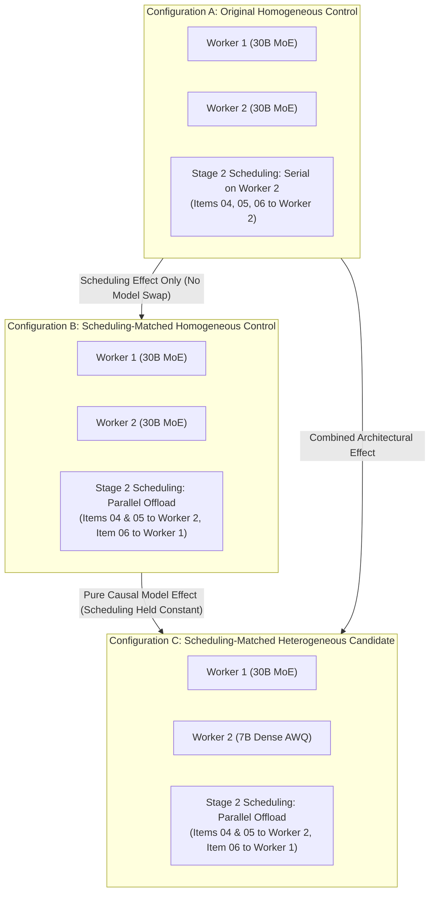

# Phase 13 Causal Qualification Execution Plan: Scheduling-Matched Heterogeneous Analysis and Sustained Operational Proof

## 1. Governing Reference & Authorization

- **Mission**: Execute a rigorous, scheduling-matched physical qualification campaign to determine whether a heterogeneous inference topology (Worker 1 30B MoE + Worker 2 7B Dense) provides an incremental accepted-engineering outcome benefit over an identically scheduled homogeneous dual-30B system.
- **Starting Release Baseline**: Commit [`054db16`](file:///home/mike/Projects/aihost/.worktrees/phase11-model-agent-optimization) (`phase13-heterogeneous-qualification`).
- **Operating Authority**: Authorized under Section 2 of directive `PHASE 13 CONTINUATION: SCHEDULING-MATCHED CAUSAL QUALIFICATION AND SUSTAINED OPERATIONAL PROOF` (`MAINT-PROP-CAUSAL-HETERO-GPU1`).
- **Protected Service Immunity Boundaries**:
  - Worker 1 (GPU 0, port 8000, tunnel 18000): Dedicated to authoritative Lead tasks, production route isolation, and security review.
  - Live daemons: Hermes Gateway (PID `986`), SSH Forwarding Tunnel (PID `2093382`), and OpenCode Runner (PID `3130937`) must remain 100% active with zero process restarts.
  - Candidate 7B model restricted strictly to non-authoritative advisory roles (test generation and schema generation).
  - External boundary validators (`ExternalAuthorityBoundary`) retain exclusive quarantine and filtering authority.
  - Zero permanent promotion; full dual-30B baseline restoration mandatory upon completion.

---

## 2. Experimental Configurations & Causal Logic

Three distinct physical configurations are evaluated under identical prompt fixtures and evaluation criteria:

1. **Configuration A (Original Homogeneous Control)**:
   - Worker 1: 30B MoE (`cyankiwi/Qwen3-Coder-30B-A3B-Instruct-AWQ-4bit`).
   - Worker 2: 30B MoE (`cyankiwi/Qwen3-Coder-30B-A3B-Instruct-AWQ-4bit`).
   - Scheduling: Stage 2 items (04, 05, 06) dispatched serially to Worker 2 (`concurrency = 2`).
2. **Configuration B (Scheduling-Matched Homogeneous Control)**:
   - Worker 1: 30B MoE.
   - Worker 2: 30B MoE.
   - Scheduling: Stage 2 items 04 & 05 dispatched to Worker 2 (`concurrency = 2`), while item 06 (Security Review) is dispatched concurrently to Worker 1 (`concurrency = 1`).
   - **Causal Function**: Isolates the performance benefit of task placement without changing model weights.
3. **Configuration C (Scheduling-Matched Heterogeneous Candidate)**:
   - Worker 1: 30B MoE.
   - Worker 2: 7B Dense AWQ (`Qwen/Qwen2.5-7B-Instruct-AWQ`).
   - Scheduling: Identical to Configuration B (Items 04 & 05 to Worker 2, Item 06 to Worker 1).
   - **Causal Function**: Isolates the pure incremental effect of the 7B AWQ model over the 30B MoE model under identical scheduling conditions.

---

## 3. Workstream Breakdown & Deliverables Mapping

| Step | Workstream & Scope | Deliverable Artifact |
| :--- | :--- | :--- |
| **1** | **Execution Plan & Governance** Document authority, execution sequence, boundary conditions. | [`phase13_causal_qualification_execution_plan.md`](file:///home/mike/Projects/aihost/.worktrees/phase11-model-agent-optimization/phase13/evidence/phase13_causal_qualification_execution_plan.md) |
| **2** | **Contract & Workload Feasibility Reconciliation** Reconcile preregistered 2.0-hr window and Poisson arrival rate ($\lambda = 4.0$ req/min). Analyze queue stability, service time distributions, and separate completed-workload from sustained queueing metrics. | [`phase13_sustained_contract_reconciliation.md`](file:///home/mike/Projects/aihost/.worktrees/phase11-model-agent-optimization/phase13/evidence/phase13_sustained_contract_reconciliation.md) |
| **3** | **Three-Configuration Protocol Freeze** Define and freeze task placement, dependency graphs, token budgets, validation gates, and concurrency limits across Configurations A, B, and C. | [`phase13_three_configuration_protocol.md`](file:///home/mike/Projects/aihost/.worktrees/phase11-model-agent-optimization/phase13/evidence/phase13_three_configuration_protocol.md) |
| **4** | **Preflight Verification & Maintenance Record** Audit live hardware, ports, service units, configuration hashes, and draft transition record `MAINT-PROP-CAUSAL-HETERO-GPU1`. | [`phase13_causal_preflight_report.md`](file:///home/mike/Projects/aihost/.worktrees/phase11-model-agent-optimization/phase13/evidence/phase13_causal_preflight_report.md) [`phase13_causal_maintenance_record.md`](file:///home/mike/Projects/aihost/.worktrees/phase11-model-agent-optimization/phase13/evidence/phase13_causal_maintenance_record.md) |
| **5** | **Physical Execution of Configuration A & B** Execute Configuration A and Configuration B on live dual-30B hardware with zero model swaps. | [`phase13_configuration_a_results.json`](file:///home/mike/Projects/aihost/.worktrees/phase11-model-agent-optimization/phase13/evidence/phase13_configuration_a_results.json) [`phase13_configuration_b_results.json`](file:///home/mike/Projects/aihost/.worktrees/phase11-model-agent-optimization/phase13/evidence/phase13_configuration_b_results.json) |
| **6** | **Temporary Worker 2 Switch & Configuration C Execution** Execute `candidate_switch.sh`, verify 7B readiness, run Configuration C and physical containment revalidation. | [`phase13_configuration_c_results.json`](file:///home/mike/Projects/aihost/.worktrees/phase11-model-agent-optimization/phase13/evidence/phase13_configuration_c_results.json) [`phase13_physical_containment_revalidation.md`](file:///home/mike/Projects/aihost/.worktrees/phase11-model-agent-optimization/phase13/evidence/phase13_physical_containment_revalidation.md) |
| **7** | **Mandatory Baseline Restoration** Execute `baseline_restore.sh`, verify dual-30B configuration SHA-256 (`641c9402`), health, and gateway isolation. | [`phase13_causal_baseline_restoration.md`](file:///home/mike/Projects/aihost/.worktrees/phase11-model-agent-optimization/phase13/evidence/phase13_causal_baseline_restoration.md) |
| **8** | **Causal Analysis & Critical-Path Attribution** Evaluate B vs C and A vs B across throughput, latency, queueing dynamics, and Stage 2 critical path. | [`phase13_sustained_queueing_analysis.md`](file:///home/mike/Projects/aihost/.worktrees/phase11-model-agent-optimization/phase13/evidence/phase13_sustained_queueing_analysis.md) [`phase13_critical_path_attribution.md`](file:///home/mike/Projects/aihost/.worktrees/phase11-model-agent-optimization/phase13/evidence/phase13_critical_path_attribution.md) [`phase13_project_acceptance_comparison.md`](file:///home/mike/Projects/aihost/.worktrees/phase11-model-agent-optimization/phase13/evidence/phase13_project_acceptance_comparison.md) [`phase13_causal_statistical_analysis.md`](file:///home/mike/Projects/aihost/.worktrees/phase11-model-agent-optimization/phase13/evidence/phase13_causal_statistical_analysis.md) |
| **9** | **Remediation, Gate Reassessment & Decision Package** Document failure log, update qualification gate register, publish corrected deployment decision package, and declare final disposition. | [`phase13_causal_failure_and_remediation_log.md`](file:///home/mike/Projects/aihost/.worktrees/phase11-model-agent-optimization/phase13/evidence/phase13_causal_failure_and_remediation_log.md) [`phase13_causal_gate_reassessment.md`](file:///home/mike/Projects/aihost/.worktrees/phase11-model-agent-optimization/phase13/evidence/phase13_causal_gate_reassessment.md) [`phase13_causal_deployment_decision_package.md`](file:///home/mike/Projects/aihost/.worktrees/phase11-model-agent-optimization/phase13/evidence/phase13_causal_deployment_decision_package.md) [`phase13_causal_final_report.md`](file:///home/mike/Projects/aihost/.worktrees/phase11-model-agent-optimization/phase13/evidence/phase13_causal_final_report.md) |
| **10**| **Manifest Update & Cumulative Regression Verification** Update `phase13/evidence/manifest.sha256` and verify 480+ tests passing. | [`manifest.sha256`](file:///home/mike/Projects/aihost/.worktrees/phase11-model-agent-optimization/phase13/evidence/manifest.sha256) |
