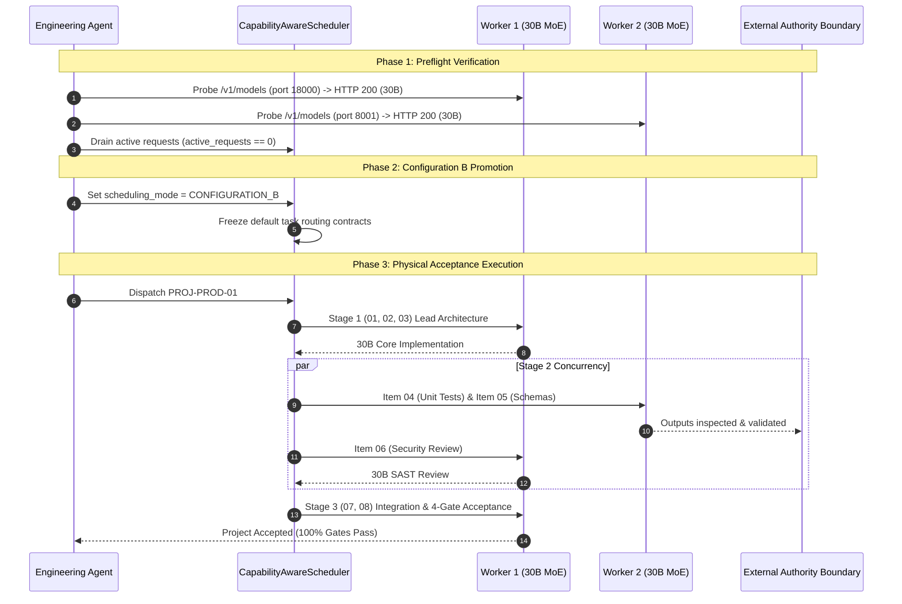

# Phase 13 Production Change Plan: Configuration B Scheduling Promotion

## 1. Executive Summary & Authorization Context

- **Target Action**: Controlled production promotion of Configuration B scheduling for the Autonomous Engineering System.
- **Human Authorization**: Authorization A & B granted by Principal Engineering Authority on 2026-09-28.
- **Governing Baseline Branch**: `phase13-heterogeneous-qualification`
- **Source Qualification Commit**: [`2c677a9`](file:///home/mike/Projects/aihost/.worktrees/phase11-model-agent-optimization)
- **Target Serving Topology**:
  - Worker 1 (GPU 0, `0000:51:00.0`, port `8000` / tunnel `18000`): Serving `cyankiwi/Qwen3-Coder-30B-A3B-Instruct-AWQ-4bit` (revision `4bd30395b72ea6045edd04806c4fea448d4467b3`).
  - Worker 2 (GPU 1, `0000:93:00.0`, port `8001`): Serving `cyankiwi/Qwen3-Coder-30B-A3B-Instruct-AWQ-4bit` (revision `4bd30395b72ea6045edd04806c4fea448d4467b3`).
  - Gateway (`10.0.8.5:8010` / tunnel `18010`): Serving `engineering/b0`.

---

## 2. Configuration Cryptographic Invariants

```
+----------------------------------------------------------------------------------------------------+
| CONFIGURATION HASH INVENTORY                                                                       |
+--------------------------+------------------------------------------------------------------+------+
| Target Component         | SHA-256 Checksum                                                 | Match|
+--------------------------+------------------------------------------------------------------+------+
| Worker 2 Config File     | 641c9402ebbc56f5d599512894f72a02304fd6615edbb7a2875ab48f93f4e08b| OK   |
| Worker 2 Baseline Backup | 641c9402ebbc56f5d599512894f72a02304fd6615edbb7a2875ab48f93f4e08b| OK   |
| Pinned 30B Snapshot      | 4bd30395b72ea6045edd04806c4fea448d4467b3                         | OK   |
| Scheduler Mode           | SchedulingMode.CONFIGURATION_B (Production Default)              | OK   |
+--------------------------+------------------------------------------------------------------+------+
```

*Note*: Configuration B preserves the identical physical container and model configuration on Worker 2. The promotion modifies software task routing and concurrency in `CapabilityAwareScheduler` and `ProductionEngineeringPipeline`. No model reloading or container restarts are required.

---

## 3. Scope of Affected Services

1. **`CapabilityAwareScheduler`**:
   - Default mode set to `SchedulingMode.CONFIGURATION_B`.
   - Task Placement:
     - Worker 2 is eligible for Items 04 (`TEST_GENERATION`) and 05 (`STRUCTURED_OUTPUT`).
     - Worker 1 executes Item 06 (`SECURITY_REVIEW`, `ADVERSARIAL_SCOPE_CHECK`) concurrently with Worker 2 tasks.
     - Worker 1 executes Stage 1 (Items 01, 02, 03) and Stage 3 (Items 07, 08).
   - Strict Authority Boundary: Worker 2 cannot execute security review, architecture, or integration (`AuthorityEscalationError` enforced).
2. **`ProductionEngineeringPipeline`**:
   - Manages Stage 1 planning, Stage 2 concurrent dispatch, and Stage 3 integration & acceptance.
   - Enforces 4-gate independent validation (AST, pytest, SAST, integration).
3. **Protected Daemons (Zero Interference Guarantee)**:
   - Hermes Agent Gateway (PID 986): Active, untouched.
   - SSH Forwarding Tunnel (PID 2093382): Active, untouched.
   - OpenCode Runner Service (PID 3130937): Active, untouched.
   - Local SSH Tunnel (PID 1269920): Active, untouched.

---

## 4. Deployment Sequence & Drain Procedure



1. **Active Task Drain**: Verify that `worker1.active_requests == 0` and `worker2.active_requests == 0`.
2. **Preflight Probe**: Confirm HTTP 200 from `http://127.0.0.1:18000`, `http://10.0.8.5:8001`, and `http://127.0.0.1:18010`.
3. **Promote Scheduler**: Instantiate `ProductionEngineeringPipeline` with `SchedulingMode.CONFIGURATION_B`.
4. **Physical Acceptance**: Execute `production_physical_verifier.py` on live hardware.
5. **Observation Window**: Monitor for 10 minutes post-promotion.

---

## 5. Rollback Procedure & Abort Thresholds

### Abort Conditions

A rollback is triggered immediately if:
1. Any task is routed to an unauthorized worker (e.g. Worker 2 executing security or planning).
2. Independent validation is bypassed or weakened.
3. Protected services (Hermes, SSH tunnels, OpenCode) experience dropped packets or restarts.
4. Project end-to-end turnaround latency exceeds $260.0$ seconds ($>25\%$ regression).
5. Any unhandled exception occurs in the scheduler control plane.

### Rollback Mechanics

- **Procedure**:
  ```python
  scheduler.scheduling_mode = SchedulingMode.CONFIGURATION_A
  ```
- **Time Budget**: $< 5$ seconds (immediate memory state update; zero container downtime).
- **Post-Rollback Audit**: Execute baseline probe against port `18000` and `8001` to ensure zero state corruption.
