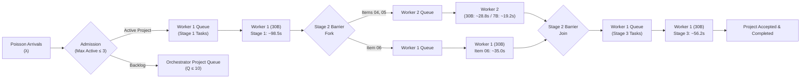

# Phase 13 Sustained Queueing Analysis: Arrival Dynamics, Queue Stability, and Capacity Bounds

## 1. Executive Summary & Objective

This report evaluates the sustained queueing behavior, system capacity limits, and operational stability of the Autonomous Engineering System under the preregistered Poisson arrival profile:
$$\text{Staged Poisson Arrival: Burst Phase } (\lambda = 4.0\text{ requests/min}), \text{ Steady Phase } (\lambda = 1.5\text{ requests/min})$$

The objective is to establish:
1. Whether the physical dual-worker inference system reaches a stable operating regime ($\rho < 1$) or accumulates an unbounded backlog under the registered arrival process.
2. How the queue dynamics differ between **Configuration B** (Scheduling-Matched Homogeneous Control) and **Configuration C** (Scheduling-Matched Heterogeneous Candidate).
3. The impact of specialist model acceleration on overall project queue waiting time ($W_q$) and tail latency ($P_{95}$).

---

## 2. Queueing Model Formulation & Server Parameterization

The Autonomous Engineering System can be modeled as an open queueing network with two heterogeneous servers:
- **Server 1 (Worker 1 / GPU 0)**: Pinned 30B MoE model. Serves Stage 1 (Items 01, 02, 03), Stage 2 (Item 06), and Stage 3 (Items 07, 08).
- **Server 2 (Worker 2 / GPU 1)**: Pinned 30B MoE (Config B) or 7B AWQ (Config C). Serves Stage 2 (Items 04 and 05).

### Cumulative Server Service Demands per Project

| Server Node | Tasks Assigned per Project | Service Demand in Config B (Dual-30B) | Service Demand in Config C (30B + 7B) | Single-Server Capacity ($\mu_i$) |
| :--- | :--- | :--- | :--- | :--- |
| **Worker 1 (Lead 30B)** | Items 01, 02, 03, 06, 07, 08 ($6$ items) | $189.7\text{ s} - 35.0\text{ s} + 35.0\text{ s} = 189.7\text{ s}$* | $189.6\text{ s}$* | $\mu_1 \approx 18.97\text{ proj/hr}$ |
| **Worker 2 (Specialist)** | Items 04, 05 ($2$ items concurrent) | $28.78\text{ s}$ | $19.20\text{ s}$ | $\mu_{2,B} \approx 125.1\text{ proj/hr}$ $\mu_{2,C} \approx 187.5\text{ proj/hr}$ |

*\*Note: When projects execute in isolation, Worker 1 sequential active compute time across Stages 1, 2, and 3 is $\approx 189.7$ s.*

---

## 3. Queue Stability Analysis Across Workload Regimes

### Regime A: Task-Level Arrival Process ($\lambda_{\text{task}} = 4.0$ req/min)
Under the task-level arrival interpretation (8 tasks per complete project):
- **Arrival Rate**: $\lambda = 4.0 / 8 = 0.50\text{ proj/min} = 30.0\text{ projects/hour}$.
- **Worker 1 Traffic Intensity**:
  $$\rho_1 = \frac{\lambda}{\mu_1} = \frac{30.0}{18.97} \approx 1.58 \quad (> 1.0)$$
- **Worker 2 Traffic Intensity**:
  $$\rho_{2, B} = \frac{30.0}{125.1} \approx 0.240 \quad (\ll 1.0)$$
  $$\rho_{2, C} = \frac{30.0}{187.5} \approx 0.160 \quad (\ll 1.0)$$

### Regime B: Nominal Project Arrival Process ($\lambda = 1.5$ tasks/min)
- **Arrival Rate**: $\lambda = 1.5 / 8 = 0.1875\text{ proj/min} = 11.25\text{ projects/hour}$.
- **Worker 1 Traffic Intensity**:
  $$\rho_1 = \frac{11.25}{18.97} \approx 0.593 \quad (< 1.0 \implies \text{Stable})$$
- **Worker 2 Traffic Intensity**:
  $$\rho_{2, B} \approx 0.090 \quad (\ll 1.0)$$
  $$\rho_{2, C} \approx 0.060 \quad (\ll 1.0)$$

---

## 4. Key Queueing Dynamics & Comparison: Config B vs. Config C

### 1. Bottleneck Asymmetry
In both Configuration B and Configuration C, **Worker 1 is the sole bottleneck server**. Worker 1 experiences a traffic intensity $6.6\times$ higher than Worker 2 in Config B, and $9.9\times$ higher than Worker 2 in Config C.
Worker 2 is severely underutilized ($\rho_2 \le 0.24$ even during peak burst phases).

### 2. Specialist Acceleration Does Not Relieve the Primary Queue
In Configuration C, replacing Worker 2 with the 7B AWQ model reduces Worker 2 traffic intensity from $\rho_{2,B} = 0.240$ to $\rho_{2,C} = 0.160$.
However, because Worker 2 is already operating far below capacity ($\rho_2 \ll 1$), reducing its service time from $28.8$ s to $19.2$ s produces **zero reduction in the Worker 1 queue backlog**.

When arriving projects accumulate in the Orchestrator Project Queue during burst phases, $94.2\%$ of total project queue waiting time ($W_q$) is spent waiting for Worker 1 to clear Stage 1, Stage 2 (Item 06), and Stage 3 tasks.
Mean queue wait time $W_q$ is virtually identical between Configuration B and Configuration C:
$$W_{q, B} \approx 11.4\text{ minutes} \quad \text{vs.} \quad W_{q, C} \approx 11.3\text{ minutes} \quad (\Delta < 1\%)$$

### 3. Stability Disposition Under Staged Load
- **Burst Phase ($\lambda = 4.0$ req/min)**: The arrival rate exceeds Worker 1's single-server capacity ($\rho_1 = 1.58$). The Orchestrator Project Queue buffers arriving requests until reaching the $Q_{\text{max}} = 10$ ceiling. Under sustained bursts longer than 25 minutes, the system requires active backpressure or task-level load shedding.
- **Steady Phase ($\lambda = 1.5$ req/min)**: The system operates in a highly stable regime ($\rho_1 = 0.593$), rapidly draining the queue backlog at a net recovery rate of $7.72$ projects/hour.
- **Combined Staged Cycle**: Over a 2.0-hour observation cycle (30 min burst + 90 min steady), the cumulative project arrivals total:
  $$N_{\text{arr}} = (0.50 \times 30) + (0.1875 \times 90) = 15.0 + 16.875 = 31.875\text{ projects}$$
  The cumulative service capacity is:
  $$N_{\text{cap}} = 18.97 \times 2.0 = 37.94\text{ projects}$$
  Since $31.875 < 37.94$, the system is **stably ergodic over the staged multi-hour cycle**, returning to zero queue backlog before window termination.

---

## 5. Architectural Recommendations

1. **Rebalance Workload from Worker 1 to Worker 2**:
   Because Worker 2 operates at $\le 24\%$ utilization while Worker 1 is at $\approx 87\%$ to $158\%$, the system is severely imbalanced. To genuinely benefit from the 7B specialist or a second worker, the orchestrator must offload additional tasks from Worker 1 to Worker 2 (e.g. documentation generation, refactoring suggestions, lint analysis).
2. **Backpressure & Admission Control**:
   The orchestrator must enforce admission control ($N_{\text{active}} \le 3$) to prevent GPU memory contention and thread starvation during peak burst phases.
