# Autonomous Engineering System: Phase 7 Engineering Plan
## Sustained Autonomous Engineering Qualification

---

## 1. Current Architecture and Dependency Map

The Phase 6 Autonomous Engineering System establishes an offline and detached engineering service capable of operating on real codebase components (`aihost`).

```mermaid
flowchart TD
    subgraph ControlPlane [Control Plane & Durable Storage]
        Engine["WorkflowEngine (SQLite WAL + Monotonic Fencing)"]
        Store["ArtifactStore (CAS SHA-256 Storage)"]
        Adm["AdmissionEvaluator (Contract Validation)"]
        Plan["ExecutionPlanner (Dependency DAG Generation)"]
        Router["EvidenceBasedRouter (Specialist Selection & Fallback)"]
        Val["IndependentValidator (Isolated Sandbox Execution)"]
        Repair["BoundedRepairController (Feedback Loops)"]
        RevMgr["WorkOrderRevisionManager (Dynamic Revisions)"]
    end

    subgraph ServiceLayer [Persistent Service Layer]
        Daemon["PersistentEngineeringService (Background Daemon)"]
        Queue["Durable Queue & Startup Crash Recovery"]
        Obs["ServiceObservability (Health & Telemetry)"]
    end

    subgraph RealRepoLayer [Real Repository Integration]
        Investigator["RepositoryInvestigator (AST Extraction & Context)"]
        Pipeline["RealRepoEngineeringPipeline (Lifecycle Orchestrator)"]
        BundleExport["CAS Deliverable Bundle Exporter + INTEGRATION_GUIDE.md"]
    end

    subgraph WorkerExecution [Untrusted Execution Layer]
        AuthorWorker["Author Worker (Physical Qwen3-Coder AWQ TP=1 Dual-Worker Gateway)"]
        ReviewWorker["Reviewer Worker (Specialized Adapter / Live Homogeneous)"]
    end

    Daemon --> Queue
    Daemon --> Pipeline
    Pipeline --> Investigator
    Pipeline --> Plan
    Pipeline --> Router
    Pipeline --> AuthorWorker
    Pipeline --> ReviewWorker
    Pipeline --> Val
    Pipeline --> Repair
    Pipeline --> BundleExport
    Engine --- ControlPlane
    Store --- ControlPlane
```

---

## 2. Existing Execution and Authorization Boundaries

1. **Human Interface Detachment Boundary**:
   - Humans interact solely through work orders (via CLI or programmatic submission).
   - The interface may disconnect immediately after compilation and admission.
   - The execution system operates independently via `PersistentEngineeringService`.
2. **Authority & Admission Boundary**:
   - Every engineering action requires an admitted `WorkOrder` with immutable `contract_hash`.
   - Authorized mutation paths are strictly bounded; changes outside these paths are rejected.
3. **Worker Lease & Fencing Boundary**:
   - Workers possess zero inherent workflow authority.
   - All state transitions require a time-bounded lease and a monotonic fencing token.
   - Stale, expired, or superseded leases fail closed with `WorkflowEngineError`.
4. **Independent Sandbox Validation Boundary**:
   - No worker can self-certify its outputs.
   - Deliverables are copied into temporary isolated sandboxes where test suites run independently.
5. **Supervisor Authoritative Disposition Boundary**:
   - Terminal acceptance or rejection is recorded solely by the control plane based on sandboxed validation evidence.
6. **Protected Process Non-Interference Boundary**:
   - Background campaign services (Hermes Gateway PID `986`, OpenCode PID `3130937`, SSH Tunnel PID `2093382`) must never be signaled, contested, or interrupted.

---

## 3. Relevant Source Modules and Tests

### Source Modules
- `phase6/src/autonomous_engineering/workflow/real_repo_pipeline.py`: End-to-end real-repo pipeline.
- `phase6/src/autonomous_engineering/service/engineering_service.py`: Persistent daemon and queueing.
- `phase6/src/autonomous_engineering/investigation/repo_investigator.py`: AST extraction.
- `phase6/src/autonomous_engineering/work_order/versioning.py`: Revision management.
- `phase6/src/autonomous_engineering/workflow/engine.py`: SQLite WAL engine and fencing tokens.
- `phase6/src/autonomous_engineering/validator/independent.py`: Sandboxed validator.

### Regression Test Modules (138 Tests)
- `phase0/tests` (39 tests): Artifacts, admission, tokens, bounded repair, failure injection, vertical slice.
- `phase1/tests` (16 tests): Containment, live adapter, real process recovery, live e2e.
- `phase2/tests` (17 tests): Multi-worker recovery, representative cohorts.
- `phase3/tests` (24 tests): Bounded revisions, CLI, interruption recovery, reliability cohort.
- `phase4/tests` (19 tests): Candidate qualification, heldout fixtures, specialist roles.
- `phase5/tests` (13 tests): Evidence router, matched live comparison, interruption recovery.
- `phase6/tests` (10 tests): Real repo pipeline, cohort execution, persistent service, revisions.

---

## 4. Phase 6 Invariants That Must Remain Intact

1. **Non-Interference**: Zero impact on PIDs 986, 3130937, 2093382.
2. **Deterministic Disposition**: Every work order terminates in `ACCEPTED`, `REJECTED`, or `CANCELLED`.
3. **Monotonic Fencing**: Incremented tokens invalidate and reject all stale worker attempts.
4. **Point-of-Use Authorization**: Mutation paths and token validity are checked prior to every commit and export.
5. **Deliverable Custody**: Every deliverable package contains `patch.diff`, `review_report.json`, `manifest.sha256`, and `INTEGRATION_GUIDE.md`.
6. **100% Test Suite Pass Rate**: All 138 existing tests must continue to pass without regression.

---

## 5. Identified Failure Modes

1. **FM-1 (Mid-Flight Crashes)**: Service or worker crash at 11 discrete lifecycle boundaries (pre-lease to post-export).
2. **FM-2 (Zombie Worker Commits)**: Delayed or stale worker attempts to write results after a lease has expired or been reclaimed.
3. **FM-3 (Adversarial Revision State)**: Supervisor cancels or restricts scope while workers are actively executing steps.
4. **FM-4 (Concurrent Workspace Collisions)**: Multiple tasks mutating overlapping files without coordination or serialization.
5. **FM-5 (Queue Saturation / Worker Exhaustion)**: Massive influx of work orders causing unbounded resource growth.
6. **FM-6 (Validator / Sandbox Failures)**: Sandboxes failing to clean up or execution timeouts during pytest.
7. **FM-7 (Time-of-Check to Time-of-Use Drift)**: Target repository mutated between validation and deliverable export.

---

## 6. Proposed Implementation Changes for Phase 7

To satisfy qualification without architectural bloat:

1. **`phase7/src/autonomous_engineering/service/concurrency_manager.py`**:
   - `ConcurrencyManager`: Manages bounded concurrency (default 4 workers), isolated temporary working trees per task, and workspace conflict detection (serializing tasks with overlapping file targets).
   - Queue backpressure: Rejects new submissions when queue capacity (`max_queue_depth=16`) is reached.
2. **`phase7/src/autonomous_engineering/service/observability.py`**:
   - `ServiceObservability`: Tracks active queue depth, worker utilization, lease ages, failure counts, and health status, exposing telemetry for operators.
3. **`phase7/src/autonomous_engineering/workflow/hardened_pipeline.py`**:
   - Enhances `RealRepoEngineeringPipeline` with:
     - Comprehensive lifecycle hook points for failure injection.
     - Strict point-of-use scope verification on unified diff hunks.
     - TOCTOU repository state verification: captures baseline hash before validation and verifies identical state before export.
4. **`phase7/src/autonomous_engineering/eval/cohort_generator.py`**:
   - Unseen real-repository cohort generator with 5 diverse engineering tasks, including deliberate invalid requirements and prohibited scope modifications to prove fail-closed rejection.

---

## 7. Independent Validation Strategy

- **Crash Injection Matrix**: Programmatic simulation of crashes at all 11 lifecycle boundaries, verifying recovery and fail-closed state.
- **Adversarial Revocation Tests**: Concurrent cancellation, rapid revisions, and expired token rejections.
- **Concurrent Execution Suite**: Multi-threaded execution across isolated workspaces with conflict serialization.
- **Unseen Real-Repo Cohort**: Evaluation of 5 new tasks against frozen criteria, measuring full distribution (accepted, repaired, rejected).
- **TOCTOU & Tamper Tests**: Intentional tampering with patches and repository files to prove deliverable custody rejection.

---

## 8. Protected-Service Non-Interference Strategy

- Process verification before, during, and after all test suites and demonstration scripts.
- Use of dedicated temporary SQLite databases and temporary directories (`tempfile.TemporaryDirectory()`).
- No port binding on ports used by protected services (18010, 8000, 8010, etc.).
- Explicit assertion of PID existence and command line invariance in every qualification gate.

---

## 9. Rollback and Recovery Procedures

1. **Git Isolation**: All changes are committed solely to `phase7-sustained-qualification` in `.worktrees/phase7-sustained-qualification`.
2. **Immediate Rollback**: `git checkout da54731` restores the verified Phase 6 state.
3. **Clean Teardown**: In the event of test failure, temporary sandbox and artifact directories are purged, and SQLite WAL files are safely closed.

---

## 10. Qualification Gates and Acceptance Criteria (G1–G10)

| Gate | Description | Mandatory Acceptance Criteria |
| :--- | :--- | :--- |
| **G1: Baseline Integrity** | Verification of Phase 6 baseline | Commit `da54731` verified, dual TP=1 topology documented, manifest verified |
| **G2: Regression Integrity** | Full test suite regression check | 138/138 prior tests pass + all new Phase 7 tests pass (100% pass rate) |
| **G3: Crash Recovery** | Controlled failure injection | All 11 lifecycle boundaries tested; zero duplicate commits; leases reclaimed |
| **G4: Authority Enforcement** | Adversarial authority testing | Stale, expired, revoked, or out-of-scope commits 100% rejected |
| **G5: Concurrent Execution** | Concurrent workload qualification | Isolated workspaces, conflict serialization, queue backpressure verified |
| **G6: Independent Acceptance** | Unseen real-repo cohort evaluation | 5 tasks evaluated; full distribution reported (including rejections) |
| **G7: Resource Containment** | Resource limits & backpressure | Queue depth bounded; timeouts enforced; fail-closed behavior on disk/db errors |
| **G8: Non-Interference** | Campaign process protection | PIDs 986, 3130937, 2093382 active and undisturbed throughout all stages |
| **G9: Deliverable Custody** | Cryptographic deliverable integrity | TOCTOU check verified; corrupted manifests/patches rejected; guide present |
| **G10: Unattended Operation** | Sustained operation demonstration | Standalone demo runs unattended through queueing, crashes, and delivery |
