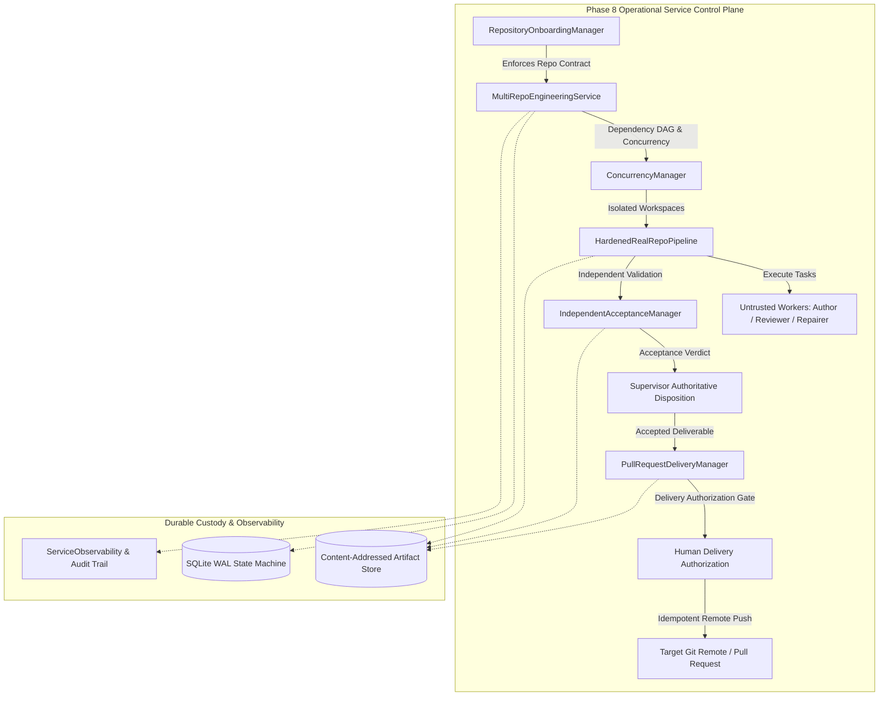
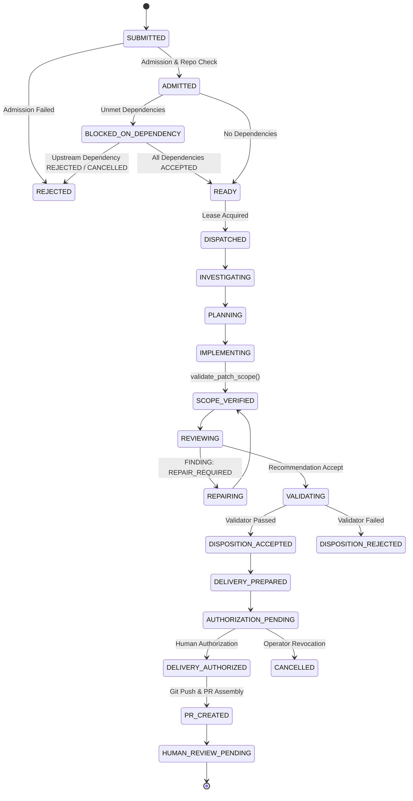

# Autonomous Engineering System: Phase 8 Engineering Plan
## Controlled Autonomous Engineering Operationalization

**Date**: September 27, 2026  
**Status**: APPROVED & FROZEN  
**Target Branch**: `phase8-operational-delivery`  
**Base Commit**: `512543a` (`phase7-sustained-qualification`)  
**Terminal Disposition Target**: `PHASE_8_CONTROLLED_AUTONOMOUS_ENGINEERING: PROVEN`

---

## 1. Current Architecture & Module Dependency Map

The Phase 7 baseline provides a hardened foundation for unattended, crash-consistent engineering execution against a single repository. Phase 8 operationalizes this into a persistent, multi-repository engineering service with human-controlled pull request delivery.

### Module Dependency Hierarchy:
1. `core`: Primitives, content hashing (`content_hash`), enums, base dataclasses.
2. `authority`: Work-order admission, scope guards, capability tokens, monotonic fencing.
3. `repository`: New Phase 8 repository contract & onboarding subsystem (`RepositoryContract`, `RepositoryOnboardingManager`).
4. `workflow`: State machine (`WorkflowEngine`), pipeline lifecycle (`HardenedRealRepoPipeline`), DAG execution.
5. `service`: Multi-repository orchestration (`MultiRepoEngineeringService`), workspace isolation & path locks (`ConcurrencyManager`), observability (`ServiceObservability`).
6. `validator`: Acceptance contract, independent validation engine (`IndependentAcceptanceManager`).
7. `delivery`: Staged delivery lifecycle, authorization records, git push & PR preparation (`PullRequestDeliveryManager`).

---

## 2. Phase 7 Invariants That Must Remain Intact

The following invariants established in Phase 7 are non-negotiable and strictly preserved:
1. **Control Plane Authority**: Models and execution adapters are untrusted workers. Models never own execution authority or task state.
2. **Crash Consistency**: The control plane persists all state transitions in SQLite WAL mode. Restart recovery automatically reclaims abandoned leases and increments fencing tokens.
3. **Point-of-Use Scope Validation**: Diff hunks are checked against `authorized_mutation_paths` prior to sandbox validation or deliverable export. Any unauthorized hunk triggers immediate `ScopeViolationError` and transitions to `REJECTED_SCOPE_VIOLATION`.
4. **Target Repository TOCTOU Protection**: Target repository tree hashes are captured pre-validation and verified pre-export. Any out-of-band mutation raises `TOCTOUMutationError` and halts delivery.
5. **Campaign Process Non-Interference**: Hermes Gateway (PID `986`), OpenCode Runner (PID `3130937`), and SSH Tunnel (PID `2093382`) must remain active, undisturbed, and un-signaled throughout.
6. **Zero Post-Hoc Alterations**: Test assertions, qualification thresholds, and preregistered criteria are frozen.

---

## 3. Proposed Phase 8 Components & Interfaces

Phase 8 extends Phase 7 incrementally without creating parallel or redundant subsystems:

### 3.1 `RepositoryOnboardingManager` (`autonomous_engineering/repository/onboarding.py`)
- Defines `RepositoryContract`:
  - `repository_id`: Canonical immutable identifier (e.g. `repo-aihost-core`).
  - `remote_url`: Authorized Git remote URL.
  - `baseline_commit`: Immutable Git commit hash.
  - `permitted_branches`: Tuple of allowed integration branches (e.g. `("main", "develop")`).
  - `authorized_mutation_paths`: Allowed directory/file prefixes.
  - `protected_paths`: Strictly prohibited paths (e.g. `.github/workflows/`, `security/`, `validators/`).
  - `required_test_commands`: Mandatory validation test commands.
  - `resource_budgets`: Max task time, max memory, max diff size.
  - `designated_approver`: Identity of human owner authorized to approve PR delivery.
- Methods:
  - `onboard_repository(contract)`: Validates git remote, verifies baseline commit, checks for symlink escapes and path traversal.
  - `get_contract(repository_id)`: Retrieves active contract; rejects un-onboarded repositories.
  - `offboard_repository(repository_id)`: Revokes admission, cancels active leases, preserves evidence.

### 3.2 `MultiRepoEngineeringService` (`autonomous_engineering/service/multi_repo_service.py`)
- Extends `PersistentEngineeringService` with multi-repository and dependency awareness.
- Supports:
  - `dependencies: Tuple[str, ...]`: List of upstream task IDs required for execution.
  - Cycle detection: Tarjan's or topological sort before admission.
  - Dependency verification: Downstream task dispatches only when all dependencies achieve terminal state `ACCEPTED`.
  - Repository-level concurrency limits (e.g., max 2 concurrent workers per repository).
  - Cross-task path lock conflict serialization within each repository.

### 3.3 `IndependentAcceptanceManager` (`autonomous_engineering/validator/acceptance.py`)
- Decouples validation contracts from worker authority.
- Binds:
  - Work order revision, repository baseline, authorized scope, required tests, security checks, validator version.
- Executes tests in isolated sandboxes using trusted test definitions.
- Generates `AcceptanceVerdictRecord` with cryptographic digests of all validator command outputs.

### 3.4 `PullRequestDeliveryManager` (`autonomous_engineering/delivery/pr_manager.py`)
- Implements the 6-stage delivery lifecycle:
  `VALIDATED → DELIVERY_PREPARED → AUTHORIZATION_PENDING → DELIVERY_AUTHORIZED → PR_CREATED → HUMAN_REVIEW_PENDING`
- Requires explicit `DeliveryAuthorizationRecord`:
  - `authorization_id`, `work_order_id`, `deliverable_hash`, `target_repository_id`, `target_branch`, `approver_id`, `authorized_at`.
- Performs pre-publication verification:
  - Target repository unchanged, branch permitted, deliverable manifest intact, patch matches validated tree, baseline valid, no protected path modified.
- Delivery Idempotency:
  - Checks if delivery branch (`delivery/wo-<id>`) already exists.
  - Reconciles existing branches/PRs without creating duplicates upon network retry.
- Real Pull Request Creation:
  - Exercises git remote branch creation against an authorized test git remote, generating a complete PR description with work order provenance, test logs, and rollback instructions.

---

## 4. Repository Authorization & Credential Boundaries

1. **Explicit Onboarding Requirement**: Work orders referencing any repository not present in `RepositoryOnboardingManager` fail admission closed (`RepositoryNotOnboardedError`).
2. **Protected Path Enforcement**: Modifications touching paths defined in `protected_paths` are rejected unconditionally.
3. **Credential Isolation**: Untrusted workers receive zero Git credentials, SSH keys, or API tokens. Git push operations are executed exclusively by `PullRequestDeliveryManager` inside the control plane using isolated, narrowly-scoped deployment tokens.
4. **Symlink and Alias Neutralization**: Repository paths are resolved to their canonical real paths before evaluating scope containment (`Path.resolve()`).

---

## 5. Work-Order State & Dependency Model

### Dependency Rules:
- Upstream tasks must have terminal state `ACCEPTED`.
- If an upstream task enters `REJECTED` or `CANCELLED`, dependent tasks transition to `REJECTED` with disposition `DEPENDENCY_FAILED`.
- Cyclic dependencies detected during submission trigger `DependencyCycleError` and are rejected before admission.

---

## 6. Independent Validation Architecture

To ensure models cannot game or modify their own validation:
1. **Validator Integrity**: The acceptance contract defines exact test commands and hashes of test definitions. Test files in the repository cannot override validator contracts.
2. **Sandboxed Execution**: Validation runs in a separate ephemeral sandbox (`/tmp/val_sandbox_*`) isolated from worker workspaces.
3. **Non-Zero Exit Codes**: Any test failure, timeout, or uncaught exception immediately yields `ValidationStatus.REJECTED`. Validator infrastructure errors never fail open.

---

## 7. Pull Request Delivery Authority Model

- **Autonomous Merge Prohibited**: The system creates branches and formats pull requests. It possesses **zero authority** to execute `git merge` or deploy to production.
- **Deliverable-Specific Authorization**: An authorization signature binds the exact SHA-256 deliverable digest. If a deliverable is recomputed or repaired, prior authorization is invalidated.
- **Integration Guide**: Every PR includes a deterministic rollback recipe (`git revert` / `patch -R`) and full evidence provenance.

---

## 8. Persistent-State Migration Requirements

Phase 8 builds on the existing Phase 7 SQLite schema (`work_orders`, `task_assignments`, `execution_plans`).
Additive tables are introduced without altering existing table contracts:
1. `repository_contracts`: Stores onboarded repository specifications.
2. `task_dependencies`: Tracks directed edges between work orders.
3. `delivery_records`: Tracks staged delivery lifecycle and remote PR references.

---

## 9. Operational Failure Modes & Remediation

| Failure Mode | Threat / Impact | Automated Mitigation |
|---|---|---|
| Malicious prompt injection in repo code | Worker tries to access files outside scope | Point-of-use scope guard raises `ScopeViolationError` |
| Upstream dependency fails or rejected | Downstream task starts with invalid assumptions | Cascading dependency failure; downstream rejected |
| External repo mutation during validation | TOCTOU attack; deliverable based on stale tree | Pre-export tree hash check raises `TOCTOUMutationError` |
| Interrupted remote Git push | Duplicate branches or dangling remote heads | Idempotent remote reconciliation checks existing refs |
| Un-onboarded repository submission | Unauthorized access or uncontained execution | Admission evaluator raises `RepositoryNotOnboardedError` |
| Attempt to mutate protected CI path | Compromise of build/test infrastructure | Protected path filter in `validate_patch_scope()` blocks patch |

---

## 10. Test & Qualification Strategy

A dedicated test suite in `phase8/tests/` will evaluate all Phase 8 capabilities:
1. `test_repository_onboarding.py`: Onboarding, contract enforcement, protected paths, offboarding.
2. `test_multi_repo_orchestration.py`: Multi-repository queues, dependency DAGs, cycle detection, path locks.
3. `test_independent_acceptance.py`: Strict separation of implementation vs validation authority.
4. `test_pull_request_delivery.py`: Staged lifecycle, human authorization gate, idempotency, real test repo publication.
5. `test_adversarial_security.py`: 15+ adversarial vectors (prompt injection, path traversal, remote substitution, etc.).
6. `test_phase8_preregistration_gates.py`: Formal verification of Gates G1 through G12.

---

## 11. Resource Budgets & Concurrency Limits

- **Worker Concurrency**: Max 4 concurrent worker workspaces globally; Max 2 per repository.
- **Queue Capacity**: Max 32 queued work orders.
- **VRAM Envelope**: 14.8 GiB per GPU on the dual-TP=1 gateway (`engineering/b0`).
- **Disk Cleanliness**: All temporary workspaces and sandboxes are purged upon completion.

---

## 12. Rollback & Recovery Procedures

1. **Deliverable Rollback**: Every deliverable bundle contains `deliverable.patch` and `INTEGRATION_GUIDE.md` with reverse patch application (`patch -p1 -R < deliverable.patch`).
2. **Remote Branch Cleanup**: In the event of aborted delivery, `PullRequestDeliveryManager.abort_delivery()` cleanly deletes remote delivery branches (`git push origin --delete delivery/wo-<id>`).
3. **Daemon Crash Recovery**: The daemon scans for expired leases upon restart, reclaims assignments, and fences stale zombie commits.

---

## 13. Preregistered Acceptance Criteria (Gates G1–G12)

| Gate | Title | Acceptance Requirement |
|---|---|---|
| **G1** | Baseline Integrity | Commit `512543a`, all 82 Phase 7 manifest files verified, 152/152 regression tests pass. |
| **G2** | Repository Authorization | Onboarding required for admission; protected paths enforced; offboarding clean. |
| **G3** | Multi-Repository Orchestration | Dependency DAG execution verified; cycle detection active; isolated workspaces per repo. |
| **G4** | Independent Acceptance | Implementation worker cannot modify validator definition, criteria, or evidence. |
| **G5** | PR Delivery Authority | No remote publication occurs without valid deliverable-specific human authorization. |
| **G6** | Delivery Idempotency | Network retry or crash during push reconciles cleanly without duplicate branches/PRs. |
| **G7** | Adversarial Security | All mandatory adversarial scenarios evaluated; zero authority escapes. |
| **G8** | Operational Reliability | Bounded operating envelope demonstrated under sustained workload and controlled crashes. |
| **G9** | Evidence Integrity | Provenance DAG links work order, repo, plan, diff, review, verdict, and PR metadata. |
| **G10**| Protected-Service Non-Interference | Hermes PID 986, OpenCode PID 3130937, SSH PID 2093382 active and undisturbed. |
| **G11**| Regression Integrity | Zero regressions across Phase 0–7 suite plus all new Phase 8 test suites. |
| **G12**| End-to-End Delivery | Complete lifecycle executed on a real authorized test Git repository with verified PR delivery. |
