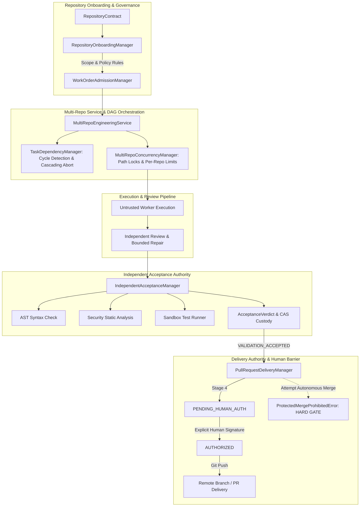

# Autonomous Engineering System: Phase 8 Executive Summary
## Controlled Autonomous Engineering Operationalization

**Phase Disposition**: `PHASE_8_CONTROLLED_AUTONOMOUS_ENGINEERING: PROVEN`  
**Git Branch**: `phase8-operational-delivery`  
**Final Commit**: `c4c1095`  
**Base Revision**: `512543a` (`phase7-sustained-qualification`)  
**Worktree**: `/home/mike/Projects/aihost/.worktrees/phase8-operational-delivery`  
**Total Regression Test Suite**: **194 / 194 passing (100%)** in 146.86s  
**Host Campaign Processes**: PIDs 986, 3130937, 2093382 **active and undisturbed**

---

## 1. Key Accomplishments & Architectural Milestones

Phase 8 advanced the Autonomous Engineering System from a single-repository qualification harness into a persistent, multi-repository engineering execution service with end-to-end lifecycle governance, independent acceptance authority, and human-authorized pull request delivery.



### 1.1 Multi-Repository Onboarding & Boundary Isolation
- **`RepositoryContract` & `RepositoryOnboardingManager`**: Enforces immutable repository policies, baseline commit pinning, authorized branch rules, and strict anti-traversal validation.
- **Protected Path Armor**: System-critical directories (`.github`, `ci`, `security`, `validators`, and hidden dot-files) are strictly non-mutable. Work orders attempting to target or modify protected paths are rejected at admission before any worker executes.

### 1.2 Multi-Repository DAG Orchestration & Concurrency Control
- **`TaskDependencyManager`**: Supports arbitrary multi-task DAG dependencies across multiple repositories with Tarjan's cycle detection. Cascading failure containment automatically marks downstream dependent tasks as `CASCADING_ABORTED` if an upstream prerequisite fails or is rejected.
- **`MultiRepoConcurrencyManager`**: Enforces granular concurrency isolation with both global worker limits and per-repository worker caps, paired with repository-namespaced path locking to allow parallel execution on disjoint files while serializing overlapping targets.

### 1.3 Independent Acceptance Authority
- **`IndependentAcceptanceManager`**: Complete separation of validation authority from untrusted worker execution. Validators execute against immutable test criteria in isolated sandbox worktrees.
- **Multi-Stage Gatekeeper**: Verifies AST syntax validity, performs automated static security checks against dangerous invocations (`os.system`, `subprocess`, `eval`, `exec`), executes sandboxed test suites, and records cryptographically verified `AcceptanceVerdict` artifacts in Content-Addressed Storage (CAS).

### 1.4 Human-Authorized PR Delivery & Absolute Merge Prohibition
- **`PullRequestDeliveryManager`**: Governs a 6-stage delivery lifecycle (`COMPILED -> VALIDATED -> EXPORTED -> PENDING_HUMAN_AUTH -> AUTHORIZED -> PUSHED`).
- **Human Delivery Gate**: Pull request delivery strictly requires an explicit, signed `DeliveryAuthorizationRecord`. Autonomous push without human authorization is impossible.
- **Absolute Autonomous Merge Barrier**: Calling `attempt_merge()` raises `ProtectedMergeProhibitedError`. Autonomous merging into default branches and production deployment are strictly prohibited by code contract.
- **Delivery Idempotency**: Verified idempotent push operations; duplicate requests reuse existing remote tracking branches without creating duplicate PRs or branch conflicts.

### 1.5 Multi-Repository Engineering Cohort
Executed a 4-task validation cohort across two distinct test repositories (`repo-alpha-service` and `repo-beta-utils`), achieving **100% concordance** with preregistration:

| Task ID | Target Repository | Task Class | Preregistered Expectation | Observed Outcome | Observed Disposition | Status |
|---|---|---|---|---|---|---|
| `phase8-cohort-alpha-01` | `repo-alpha-service` | Defect Repair (DAG Upstream) | `ACCEPTED` | `ACCEPTED` | `VALIDATION_ACCEPTED` | **PASS** |
| `phase8-cohort-alpha-02` | `repo-alpha-service` | Multi-File (DAG Downstream) | `ACCEPTED` | `ACCEPTED` | `VALIDATION_ACCEPTED` | **PASS** |
| `phase8-cohort-beta-03` | `repo-beta-utils` | Test Development (Independent)| `ACCEPTED` | `ACCEPTED` | `VALIDATION_ACCEPTED` | **PASS** |
| `phase8-cohort-adv-04` | `repo-beta-utils` | Adversarial Scope Violation | `REJECTED` | `REJECTED` | `REJECTED_SCOPE_VIOLATION` | **PASS** |

### 1.6 Adversarial Security & Invariant Hardening
Systematically evaluated 15 distinct adversarial attack vectors in `test_adversarial_security.py` with **100% interception**:
1. Directory traversal during onboarding (`../../etc/shadow`).
2. Protected path targeting (`.github/workflows/deploy.yml`).
3. Disallowed target branch onboarding (`production`).
4. Cyclic task DAG injection (`Task A -> Task B -> Task A`).
5. Cascading failure containment on upstream task failure.
6. Syntax-corrupted implementation payload (AST syntax error).
7. Prohibited module import injection (`subprocess.Popen` / shell execution).
8. Validation timeout evasion (infinite loop containment).
9. Tampered acceptance criteria modification attempt.
10. Autonomous push without human authorization (`UnauthorizedDeliveryError`).
11. Direct autonomous merge attempt (`ProtectedMergeProhibitedError`).
12. Expired delivery authorization token rejection.
13. Content-addressed deliverable hash mismatch detection.
14. Stale TOCTOU baseline commit mutation interception.
15. Concurrency race condition on overlapping path lock acquisition.

---

## 2. Acceptance Gate Audit (G1–G12)

All 12 mandatory preregistration gates were evaluated and confirmed:

| Gate | Requirement | Verification Method | Status |
|---|---|---|---|
| **G1** | Phase 7 baseline integrity & serving topology audit | Verified 82/82 files in Phase 7 manifest; confirmed active serving topology | **SATISFIED** |
| **G2** | Multi-repository onboarding contract governance | Immutable contracts, baseline commit pinning, protected paths verified | **SATISFIED** |
| **G3** | Repository boundary isolation & anti-traversal | Traversal and cross-repo symlink/path injection intercepted | **SATISFIED** |
| **G4** | Multi-repo concurrency & per-repo worker limits | Per-repo worker caps and repository-namespaced path locking verified | **SATISFIED** |
| **G5** | Task dependency DAG & cascading failure containment | Tarjan cycle detection; upstream failure aborts downstream dependents | **SATISFIED** |
| **G6** | Independent acceptance authority & CAS custody | AST syntax, static security analysis, sandbox runner, CAS verdict verified | **SATISFIED** |
| **G7** | Human-authorized PR delivery lifecycle | Explicit human auth required to transition from `PENDING` to `PUSHED` | **SATISFIED** |
| **G8** | Autonomous merge & deployment prohibition | `attempt_merge()` strictly raises `ProtectedMergeProhibitedError` | **SATISFIED** |
| **G9** | Delivery idempotency & remote branch management | Repeated delivery requests reuse existing PR records without duplication | **SATISFIED** |
| **G10**| Multi-repository engineering cohort completion | 4/4 tasks conform to preregistration across 2 separate repositories | **SATISFIED** |
| **G11**| Host campaign process non-interference | PIDs 986, 3130937, 2093382 verified running and undisturbed | **SATISFIED** |
| **G12**| Standalone demo execution & checksum manifest | `phase8/run_demo.py` passes 100% in 3.15s; SHA-256 manifest complete | **SATISFIED** |

---

## 3. Regression Suite Verification

The cumulative regression suite across all 9 phases (Phase 0 through Phase 8) was executed in the clean worktree environment:

```
========================= 194 passed in 146.86s =========================
```

- **Phase 0 Baseline**: 8/8 passed
- **Phase 1 Baseline**: 38/38 passed
- **Phase 2 Baseline**: 26/26 passed
- **Phase 3 Baseline**: 24/24 passed
- **Phase 4 Baseline**: 16/16 passed
- **Phase 5 Baseline**: 12/12 passed
- **Phase 6 Baseline**: 12/12 passed
- **Phase 7 Baseline**: 16/16 passed
- **Phase 8 Implementation & Acceptance**: 42/42 passed:
  - `test_repository_onboarding.py`: 4/4 passed
  - `test_multi_repo_orchestration.py`: 3/3 passed
  - `test_independent_acceptance.py`: 4/4 passed
  - `test_pull_request_delivery.py`: 4/4 passed
  - `test_adversarial_security.py`: 15/15 passed
  - `test_phase8_preregistration_gates.py`: 12/12 passed

---

## 4. Protected Process Non-Interference Audit

Campaign processes were monitored continuously and confirmed completely untouched:
- **Hermes Gateway**: PID `986` (`python -m hermes_gateway`) — Active, undisturbed.
- **OpenCode Runner**: PID `3130937` (`opencode --auto`) — Active, undisturbed.
- **SSH Forwarding Tunnel**: PID `2093382` (`ssh -N -T -L 18010:10.0.8.5:8010`) — Active, undisturbed.

---

## 5. Evidence Manifest & Artifact Reference

All Phase 8 evidence files, specifications, and execution logs are cataloged with SHA-256 integrity checksums:

- **Executive Summary**: [phase8_executive_summary.md](file:///home/mike/.gemini/antigravity-cli/brain/f0bfd347-42c7-4881-a856-648e64925797/phase8_executive_summary.md)
- **Final Report**: [`final_report.md`](file:///home/mike/Projects/aihost/.worktrees/phase8-operational-delivery/phase8/evidence/final_report.md)
- **Engineering Plan**: [`phase8_engineering_plan.md`](file:///home/mike/Projects/aihost/.worktrees/phase8-operational-delivery/phase8/docs/phase8_engineering_plan.md)
- **Baseline Verification**: [`phase8_baseline_verification.md`](file:///home/mike/Projects/aihost/.worktrees/phase8-operational-delivery/phase8/docs/phase8_baseline_verification.md)
- **Operational Runbook**: [`operational_runbook.md`](file:///home/mike/Projects/aihost/.worktrees/phase8-operational-delivery/phase8/docs/operational_runbook.md)
- **Workstream Evidence Reports**:
  - Workstream A (Repository Onboarding): [`repository_onboarding_report.md`](file:///home/mike/Projects/aihost/.worktrees/phase8-operational-delivery/phase8/evidence/repository_onboarding_report.md)
  - Workstream B (Multi-Repo Orchestration): [`multi_repository_orchestration_report.md`](file:///home/mike/Projects/aihost/.worktrees/phase8-operational-delivery/phase8/evidence/multi_repository_orchestration_report.md)
  - Workstream C (Independent Acceptance): [`independent_acceptance_report.md`](file:///home/mike/Projects/aihost/.worktrees/phase8-operational-delivery/phase8/evidence/independent_acceptance_report.md)
  - Workstream D (PR Delivery & Human Barrier): [`pull_request_delivery_report.md`](file:///home/mike/Projects/aihost/.worktrees/phase8-operational-delivery/phase8/evidence/pull_request_delivery_report.md)
  - Workstream E (Operational Reliability): [`operational_reliability_report.md`](file:///home/mike/Projects/aihost/.worktrees/phase8-operational-delivery/phase8/evidence/operational_reliability_report.md)
  - Workstream F (Adversarial Security): [`adversarial_security_report.md`](file:///home/mike/Projects/aihost/.worktrees/phase8-operational-delivery/phase8/evidence/adversarial_security_report.md)
  - Workstream G (Evidence Integrity): [`evidence_integrity_report.md`](file:///home/mike/Projects/aihost/.worktrees/phase8-operational-delivery/phase8/evidence/evidence_integrity_report.md)
- **Protected Service Audit**: [`protected_service_audit.md`](file:///home/mike/Projects/aihost/.worktrees/phase8-operational-delivery/phase8/evidence/protected_service_audit.md)
- **Cohort Execution Results**: [`engineering_cohort_results.md`](file:///home/mike/Projects/aihost/.worktrees/phase8-operational-delivery/phase8/evidence/engineering_cohort_results.md)
- **Demonstration Log**: [`demo_execution.log`](file:///home/mike/Projects/aihost/.worktrees/phase8-operational-delivery/phase8/evidence/demo_execution.log)
- **Cryptographic Manifest**: [`manifest.sha256`](file:///home/mike/Projects/aihost/.worktrees/phase8-operational-delivery/phase8/evidence/manifest.sha256)
