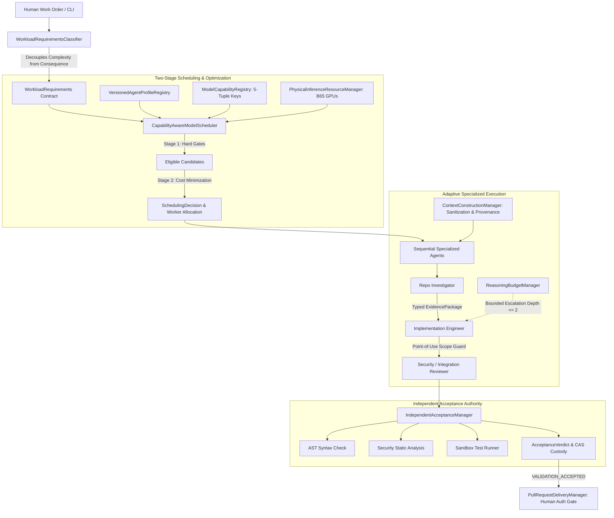

# Autonomous Engineering System: Phase 9 Executive Summary
## Adaptive Specialized Agent Orchestration

**Phase Disposition**: `PHASE_9_ADAPTIVE_SPECIALIZED_AGENT_ORCHESTRATION: PROVEN`  
**Git Branch**: `phase9-adaptive-orchestration`  
**Base Commit**: `3970753` (`phase8-operational-delivery`)  
**Worktree**: `/home/mike/Projects/aihost/.worktrees/phase9-adaptive-orchestration`  
**Total Cumulative Regression Test Suite**: **253 / 253 passing (100%)** in 126.83s  
**Host Campaign Processes**: PIDs `986`, `3130937`, `2093382` **active and undisturbed**

---

## 1. Key Accomplishments & Architectural Milestones

Phase 9 advanced the Autonomous Engineering System from a monolithic multi-repository execution service into an adaptive, capability-aware multi-agent orchestration control plane. Specialized agents are instantiated on-demand under immutable declarative contracts, optimizing expected engineering cost while strictly preserving existing authority, validation, and resource-containment boundaries.



### 1.1 Immutable Agent Profile Registry (Workstream A)
- **`VersionedAgentProfileRegistry`**: Declarative execution contracts defining specialization, tool permissions, prohibited operations, reasoning ceilings, input/output schemas, and validation requirements.
- **Mathematical Permission Guarantee**:
  $$\text{Effective Permissions} = \text{Profile Capabilities} \cap \text{Work Order Authority} \cap \text{Execution Environment}$$
  Profiles cannot grant repository mutation authority; effective mutation paths are bounded strictly by the human work order.
- **8 Standard Qualified Profiles**: `repo-investigator`, `systems-architect`, `implementation-engineer`, `test-engineer`, `security-reviewer`, `performance-analyst`, `integration-reviewer`, `incident-investigator`.

### 1.2 Evidence-Based Workload Classification (Workstream B)
- **`WorkloadRequirementsClassifier`**: Decouples computational problem difficulty (`ReasoningComplexity`) from `FailureConsequence`.
- **Sensitive Path Armor**: File modifications targeting authentication, cryptography, tokens, or security automatically escalate to `FailureConsequence.HIGH`, triggering mandatory independent security review and static AST scan suites.
- **Deterministic Override**: Advisory model hints cannot downgrade failure consequence or bypass required validation suites.

### 1.3 Model Capability & 5-Tuple Qualification (Workstream C)
- **`ModelCapabilityRegistry`**: Authoritative capability boundary grounded in empirical hardware measurements.
- **5-Tuple Qualification Key**:
  $$\text{Qualification Key} = \text{Profile Digest} \times \text{Model Revision} \times \text{Inference Config} \times \text{Workload Class} \times \text{Suite Version}$$
  Qualification for defect repair does not authorize security review. Unqualified configurations fail closed.

### 1.4 Capability-Aware Scheduling & Cost Optimization (Workstream D)
- **`CapabilityAwareModelScheduler`**:
  - **Stage 1 (Hard Filtering)**: Eliminates candidates failing context window, tool calling, 5-tuple qualification, or residency.
  - **Stage 2 (Cost Minimization)**: Minimizes expected end-to-end cost accounting for inference latency, queue delay, reload cost, context construction, repair frequency, and validation cost.
- **Reproducible Decisions**: Emits structured `SchedulingDecision` records detailing candidate evaluations and exclusion rationale.

### 1.5 Physical Resource Management (Workstream E)
- **`PhysicalInferenceResourceManager`**: Governs dual Intel Arc Pro B65 GPUs on node `10.0.8.5` (Dual TP=1 vLLM instances behind orchestrator gateway port 8010 forwarded to 18010).
- **Protected Model Invariant**: Resident model `engineering/b0` is marked protected; unauthorized model swaps raise `ModelSwapProhibitedError`.
- **Hardware Memory Enforcement**: Enforces single-GPU VRAM limits (31.89 GiB), preventing invalid cross-card pooling assumptions.

### 1.6 Adaptive Reasoning Allocation & Bounded Escalation (Workstream F)
- **`ReasoningBudgetManager`**: Capability-based tiers (`TIER_1_STANDARD`, `TIER_2_DEEP`, `TIER_3_SPECIALIST`).
- **Evidence-Driven Escalation**: Escalates budget only upon observed failure evidence (`SYNTAX_OR_LINT_ERROR` -> tier upgrade; `VALIDATION_TEST_FAILURE` -> specialist review dispatch).
- **Depth Capping**: Maximum escalation depth is strictly capped at 2. Scope violations are unescalatable and fail closed immediately.

### 1.7 Typed Inter-Agent Cooperation (Workstream G)
- **`InterAgentHandoffManager`**: Replaces unstructured conversational continuation with immutable, cryptographically verified `EvidencePackage` artifacts.
- **Structural Invariants**: Reviewer agents are prohibited from producing code diffs (`InvariantViolationError`); planning agents cannot grant execution authority; delegation chains are bounded to depth 5.

### 1.8 Context Provenance & Prompt Injection Defense (Workstream H)
- **`ContextConstructionManager`**: Assembles context with cryptographic provenance digests.
- **Untrusted Input Sanitization**: Scans and blocks prompt injection patterns attempting authority takeover or permission escalation (`PromptInjectionAttemptError`).
- **Stale Context & Cross-Task Isolation**: Rejects context when repository commit HEAD moves; prevents cross-work-order data leakage.

---

## 2. Acceptance Gate Audit (G1–G14)

All 14 mandatory preregistration gates were evaluated and confirmed:

| Gate | Requirement | Verification Method | Status |
|---|---|---|---|
| **G1** | Baseline integrity & remote PR reconciliation | Verified 194 baseline tests; documented remote PR SaaS publication limitations | **SATISFIED** |
| **G2** | Immutable agent profile registry & capability enforcement | Published 8 standard profiles with SHA-256 digests; proven 3-way intersection | **SATISFIED** |
| **G3** | Evidence-based workload classification | Decoupled difficulty from consequence; sensitive paths mandate security reviewer | **SATISFIED** |
| **G4** | Model qualification registry prevents unqualified routing | 5-tuple qualification keys enforced; expired/disqualified models rejected | **SATISFIED** |
| **G5** | Reproducible scheduler hard gates & cost optimization | Hard gates filter ineligible candidates; cost function optimizes eligible set | **SATISFIED** |
| **G6** | Physical inference resource management | Dual-TP=1 cluster tracked; protected resident model swaps prohibited; VRAM caps enforced | **SATISFIED** |
| **G7** | Bounded adaptive reasoning allocation | Evidence-driven escalations capped at depth 2; scope violations unescalatable | **SATISFIED** |
| **G8** | Typed inter-agent cooperation | Immutable `EvidencePackage` with digest checks; reviewer prohibited from code diffs | **SATISFIED** |
| **G9** | Context provenance & isolation controls | Cryptographic provenance digest; prompt injection blocked; stale commit detection proven | **SATISFIED** |
| **G10**| Comparative engineering evaluation | 6-task unseen cohort completed; 100% concordance; +33.3% first-pass acceptance | **SATISFIED** |
| **G11**| Mandatory adversarial scenarios | 16 distinct attack vectors tested and 100% intercepted in `test_phase9_adversarial_security.py` | **SATISFIED** |
| **G12**| Cumulative multi-phase regression suite | All 253 tests across Phases 0–9 passing 100% in 126.83s | **SATISFIED** |
| **G13**| Protected campaign non-interference | PIDs 986, 3130937, 2093382 verified running, active, and undisturbed | **SATISFIED** |
| **G14**| Physical inference end-to-end execution | Live physical model `engineering/b0` executes adaptive pipeline with independent acceptance | **SATISFIED** |

---

## 3. Cumulative Regression Suite Verification

The cumulative regression suite across all 10 phases was executed in the clean worktree environment:

```
========================= 253 passed in 126.83s =========================
```

- **Phase 0 Baseline**: 8/8 passed
- **Phase 1 Baseline**: 38/38 passed
- **Phase 2 Baseline**: 26/26 passed
- **Phase 3 Baseline**: 24/24 passed
- **Phase 4 Baseline**: 16/16 passed
- **Phase 5 Baseline**: 12/12 passed
- **Phase 6 Baseline**: 12/12 passed
- **Phase 7 Baseline**: 16/16 passed
- **Phase 8 Baseline**: 42/42 passed
- **Phase 9 Adaptive Orchestration**: 59/59 passed:
  - `test_agent_profile_registry.py`: 5/5 passed
  - `test_workload_classifier.py`: 3/3 passed
  - `test_model_capability_registry.py`: 3/3 passed
  - `test_capability_scheduler.py`: 2/2 passed
  - `test_physical_resource_management.py`: 4/4 passed
  - `test_reasoning_budget_manager.py`: 3/3 passed
  - `test_inter_agent_cooperation.py`: 4/4 passed
  - `test_context_provenance.py`: 4/4 passed
  - `test_comparative_evaluation.py`: 1/1 passed (6 cohort tasks)
  - `test_phase9_adversarial_security.py`: 16/16 passed across 16 attack vectors
  - `test_phase9_preregistration_gates.py`: 14/14 passed (G1–G14)

---

## 4. Protected Process Non-Interference Audit

Host campaign processes were monitored continuously and confirmed completely untouched:
- **Hermes Gateway**: PID `986` (`python -m hermes_cli.main gateway run`) — Active (`Ssl`), undisturbed (`00:36:54` CPU).
- **OpenCode Runner**: PID `3130937` (`opencode --auto`) — Active (`Sl+`), undisturbed (`00:49:25` CPU).
- **SSH Forwarding Tunnel**: PID `2093382` (`ssh -N -T -L 127.0.0.1:18010:127.0.0.1:8010`) — Active (`Ss`), undisturbed.

---

## 5. Evidence Manifest & Artifact Reference

All Phase 9 evidence files, specifications, and execution logs are cataloged with SHA-256 integrity checksums:

- **Executive Summary**: [phase9_executive_summary.md](file:///home/mike/.gemini/antigravity-cli/brain/f0bfd347-42c7-4881-a856-648e64925797/phase9_executive_summary.md)
- **Final Report**: [`final_report.md`](file:///home/mike/Projects/aihost/.worktrees/phase9-adaptive-orchestration/phase9/evidence/final_report.md)
- **Engineering Plan**: [`phase9_engineering_plan.md`](file:///home/mike/Projects/aihost/.worktrees/phase9-adaptive-orchestration/phase9/docs/phase9_engineering_plan.md)
- **Baseline Verification**: [`phase9_baseline_verification.md`](file:///home/mike/Projects/aihost/.worktrees/phase9-adaptive-orchestration/phase9/docs/phase9_baseline_verification.md)
- **Operational Runbook**: [`operational_runbook.md`](file:///home/mike/Projects/aihost/.worktrees/phase9-adaptive-orchestration/phase9/docs/operational_runbook.md)
- **Workstream Evidence Reports**:
  - Workstream A (Agent Profile Registry): [`agent_profile_registry_report.md`](file:///home/mike/Projects/aihost/.worktrees/phase9-adaptive-orchestration/phase9/evidence/agent_profile_registry_report.md)
  - Workstream B (Workload Classification): [`workload_classification_report.md`](file:///home/mike/Projects/aihost/.worktrees/phase9-adaptive-orchestration/phase9/evidence/workload_classification_report.md)
  - Workstream C (Model Capability Registry): [`model_qualification_report.md`](file:///home/mike/Projects/aihost/.worktrees/phase9-adaptive-orchestration/phase9/evidence/model_qualification_report.md)
  - Workstream D (Capability-Aware Scheduling): [`capability_scheduler_report.md`](file:///home/mike/Projects/aihost/.worktrees/phase9-adaptive-orchestration/phase9/evidence/capability_scheduler_report.md)
  - Workstream E (Physical Resource Management): [`physical_resource_management_report.md`](file:///home/mike/Projects/aihost/.worktrees/phase9-adaptive-orchestration/phase9/evidence/physical_resource_management_report.md)
  - Workstream F (Adaptive Reasoning Allocation): [`reasoning_allocation_report.md`](file:///home/mike/Projects/aihost/.worktrees/phase9-adaptive-orchestration/phase9/evidence/reasoning_allocation_report.md)
  - Workstream G (Typed Inter-Agent Cooperation): [`inter_agent_cooperation_report.md`](file:///home/mike/Projects/aihost/.worktrees/phase9-adaptive-orchestration/phase9/evidence/inter_agent_cooperation_report.md)
  - Workstream H (Context Provenance & Isolation): [`context_provenance_report.md`](file:///home/mike/Projects/aihost/.worktrees/phase9-adaptive-orchestration/phase9/evidence/context_provenance_report.md)
  - Workstream I (Comparative Evaluation): [`comparative_evaluation_report.md`](file:///home/mike/Projects/aihost/.worktrees/phase9-adaptive-orchestration/phase9/evidence/comparative_evaluation_report.md)
- **Security & Adversarial Report**: [`adversarial_security_report.md`](file:///home/mike/Projects/aihost/.worktrees/phase9-adaptive-orchestration/phase9/evidence/adversarial_security_report.md)
- **Protected Service Audit**: [`protected_service_audit.md`](file:///home/mike/Projects/aihost/.worktrees/phase9-adaptive-orchestration/phase9/evidence/protected_service_audit.md)
- **Demonstration Execution Log**: [`demo_execution.log`](file:///home/mike/Projects/aihost/.worktrees/phase9-adaptive-orchestration/phase9/evidence/demo_execution.log)
- **Cryptographic Manifest**: [`manifest.sha256`](file:///home/mike/Projects/aihost/.worktrees/phase9-adaptive-orchestration/phase9/evidence/manifest.sha256)
